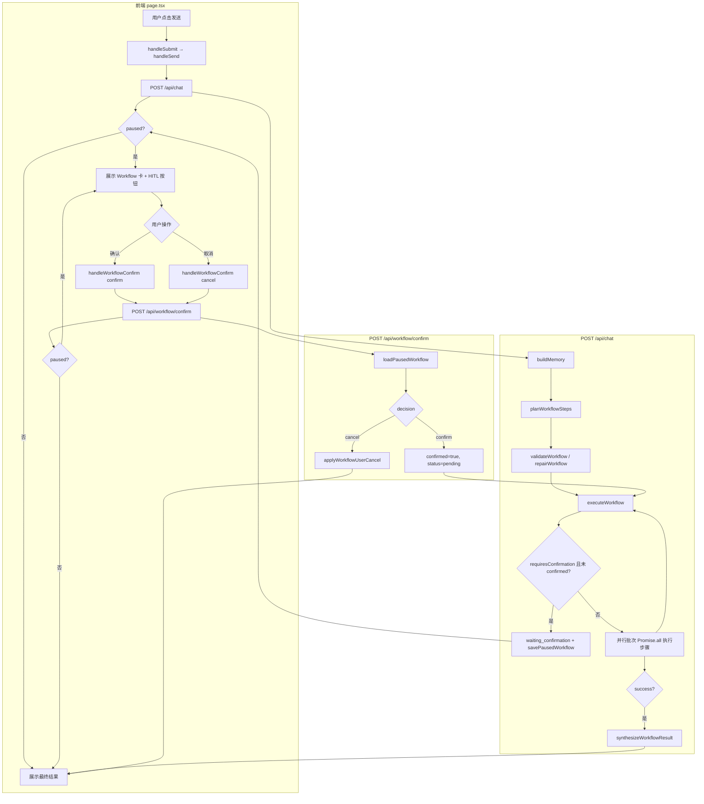
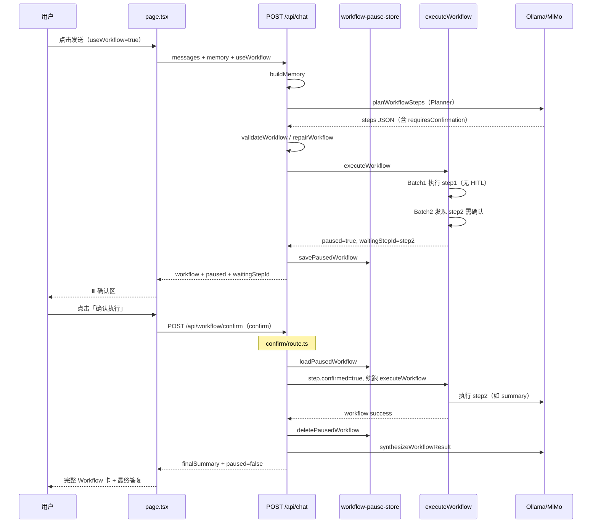
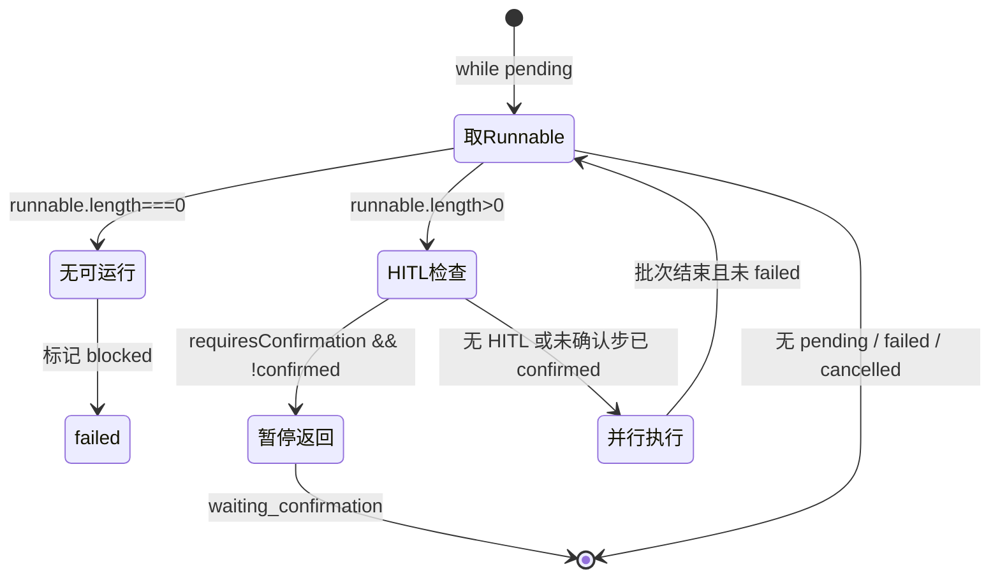

# 第18天学习总结：Conditional DAG + HITL 人工确认

对照 `ollama-chat-day17/day17_learning_summary.md` §8 学习计划，本仓库 **`ollama-chat-day18`** 在 **Conditional DAG Runtime**（第17天）之上实现了 **Human-in-the-loop（HITL）**：关键步骤执行前暂停，等待用户确认后再续跑。

- **§1–§12**：第18天实现细节、流程图、打卡验收  
- **§13**：第18天里程碑总结  
- **§14**：第19天「Workflow 持久化 + 恢复执行」学习计划（待实现）

> **核心认知**：真正可用的 Agent，不是所有事情都自动做，而是在关键节点知道停下来问人。  
> Runtime 能力从 **Conditional DAG** 升级为 **Conditional DAG + HITL**。

---

## 1. 第18天目标与能力对比

| 阶段 | 执行语义 |
|------|----------|
| 第17天 Conditional DAG | 判断（`condition` / `judge`）→ 执行或 `skipped` |
| **第18天 HITL** | 判断 → **等待用户确认** → 再执行 |

典型用户场景：

```text
用户：帮我整理今天学习内容，并生成最终提交版总结

Step1：总结学习内容          ✅ 自动执行
Step2：生成最终提交版总结    ⏸️ waiting_confirmation

是否继续执行？
[确认执行] [取消]

用户确认后 → Step2 继续执行 ✅ → Workflow 完成 ✅
```

---

## 2. 数据模型与类型

### 2.1 `WorkflowStep` 新增字段

定义见 `lib/workflow-types.ts`，前后端 `page.tsx` / `route.ts` 与之对齐。

| 字段 | 含义 |
|------|------|
| `requiresConfirmation?: boolean` | 本步**调用模型前**是否需用户确认 |
| `confirmationMessage?: string` | 确认 UI 展示文案 |
| `confirmed?: boolean` | 用户点击「确认执行」后为 `true` |
| `status: "waiting_confirmation"` | **暂停态**：非 `failed`、非 `skipped` |
| `skipReason?: string` | 取消时可为 `"user cancelled"` |

### 2.2 执行器返回值

```ts
type ExecuteWorkflowResult = {
  workflow: Workflow
  paused?: boolean           // true = HITL 暂停
  waitingStepId?: string     // 待确认步骤 id
}
```

### 2.3 API 响应扩展

`POST /api/chat` 与 `POST /api/workflow/confirm` 在 `type: "workflow"` 时均可携带：

- `paused: true`
- `waitingStepId: "step2"`

---

## 3. 实现映射（对照 §8 任务清单）

| 任务 | 实现位置 |
|------|----------|
| `requiresConfirmation` / `confirmationMessage` / `waiting_confirmation` | `lib/workflow-types.ts`、`app/api/chat/route.ts` |
| Executor 暂停（`Promise.all` 前检测） | `executeWorkflow` |
| 暂停上下文暂存 | `lib/workflow-pause-store.ts`（进程内 `Map`） |
| `POST /api/workflow/confirm` | `app/api/workflow/confirm/route.ts` |
| 用户确认续跑 / 取消（**策略 A**） | `confirm` + `applyWorkflowUserCancel` |
| Planner HITL 提示词 | `planWorkflowSteps` |
| Validator + Auto repair | `validateWorkflow`、`repairWorkflowConfirmationMessage` |
| 前端确认按钮 | `app/page.tsx` → `handleWorkflowConfirm` |
| `[HITL]` 调试日志 | `route.ts`、`confirm/route.ts` |
| Timeline HITL 事件 | `⏸️ 等待确认`、`👤 用户已确认` |

---

## 4. 端到端调用链（从前端点击「发送」开始）

### 4.1 阶段 A：用户首次提交

#### 前端（`app/page.tsx`）

```text
用户点击「发送」或回车
  → <form onSubmit={handleSubmit}>
  → handleSubmit(e)           // e.preventDefault()
  → handleSend()
```

**`handleSend()` 主要步骤：**

1. `input.trim()` 校验；`loading` 时直接返回。
2. 将已有 `bubbles` 扁化为 `ChatMessage[]`，追加本轮用户句 → `withUser`。
3. `scheduleBubblesCommit` 乐观渲染用户气泡；`setLoading(true)`。
4. **`fetch("POST /api/chat")`**，请求体：

   ```json
   {
     "messages": [...],
     "memory": { "shortTerm": [], "items": [] },
     "useWorkflow": true,
     "provider": "local" | "mimo",
     "mimoModel": "..."
   }
   ```

5. 成功：`setMemory(data.memory)`，`apiToAssistant(data)` 追加 workflow 卡片。
6. 若 `data.paused === true`：卡片内展示 HITL 确认区（见 §4.3）。

#### 后端（`app/api/chat/route.ts` → `POST`）

当 `useWorkflow === true` 时走工作流管道，**不走**单步路由 `buildRoutingSystemPrompt`：

```text
POST(req)
  → buildMemory(messages, incomingMemory, rt)
  → planWorkflowSteps(goal, memory, rt)          // Planner：可能产出 requiresConfirmation
  → 组装 Workflow { id, goal, steps: pending... }
  → validateWorkflow(workflow)
       ├─ 失败 → repairWorkflow(workflow)        // 含 repairWorkflowConfirmationMessage
       └─ 再 validate；仍失败则 status=failed 早返回
  → workflow.status = "running"
  → executeWorkflow(workflow, memory, rt, { timeline, defaultStepRetries })
       ├─ 正常跑完 → synthesizeWorkflowResult → 返回 paused: false
       └─ HITL 暂停 → savePausedWorkflow(ctx) → 返回 paused: true, waitingStepId
```

**`planWorkflowSteps` 要点：**

- 提示词要求：最终提交/删除覆盖/不可逆操作等 → `requiresConfirmation: true` + `confirmationMessage`。
- `parsePlannerPlanOutput` → `finalizePlannerPlanItems` 解析 HITL 字段。

**`executeWorkflow` HITL 核心逻辑（每批调度前）：**

```ts
const runnable = getRunnableSteps(...)  // 依赖已满足、status=pending 的步骤
const hitlStep = runnable.find(s => s.requiresConfirmation && !s.confirmed)
if (hitlStep) {
  hitlStep.status = "waiting_confirmation"
  timeline.push("⏸️ ... 等待用户确认")
  console.log("[HITL]", { workflowId, stepId, status, decision: "pause" })
  return { workflow, paused: true, waitingStepId: hitlStep.id }
  // ⚠️ 不进入 Promise.all，整单 workflow 暂停
}
// 否则：queued → Promise.all(runOneStepWithRetries) → 下一批
```

**暂停后 `POST /api/chat` 响应：**

```json
{
  "type": "workflow",
  "workflow": { "...": "含 waiting_confirmation 的 step" },
  "finalSummary": "工作流已暂停，等待您确认关键步骤...",
  "memory": { ... },
  "paused": true,
  "waitingStepId": "step2"
}
```

同时 **`savePausedWorkflow`** 写入 `workflow-pause-store`（`workflow` + `memory` + `timeline` + `defaultStepRetries`），供 confirm API 续跑。

---

### 4.2 阶段 B：用户点击「确认执行」或「取消」

#### 前端

```text
Workflow 卡片内按钮 onClick
  → handleWorkflowConfirm(bubbleIndex, workflowId, stepId, "confirm" | "cancel")
  → fetch("POST /api/workflow/confirm", { workflowId, stepId, decision, memory, provider, mimoModel })
  → 用返回的 workflow / paused / waitingStepId 原地更新该条 assistant 气泡
```

#### 后端（`app/api/workflow/confirm/route.ts`）

```text
POST(req)
  → loadPausedWorkflow(workflowId)     // 无则 404
  → buildModelRuntime(provider, mimoModel)
  → decision === "cancel"
       → applyWorkflowUserCancel(workflow, stepId, timeline)   // 策略 A
       → deletePausedWorkflow
       → 返回 workflow.status=cancelled, paused=false
  → decision === "confirm"
       → step.confirmed = true
       → step.status = "pending"
       → timeline.push("👤 用户已确认，继续执行...")
       → executeWorkflow(workflow, memory, rt, { timeline, defaultStepRetries })
            ├─ 再次 HITL 暂停 → savePausedWorkflow → paused: true
            └─ 跑完 → deletePausedWorkflow → synthesizeWorkflowResult → paused: false
```

**`applyWorkflowUserCancel`（策略 A）：**

- 目标步 `status = "skipped"`，`skipReason = "user cancelled"`。
- `workflow.status = "cancelled"`。
- 剩余 `pending` 步扫为 `blocked`。
- **不**继续执行后续步骤。

---

### 4.3 前端 HITL UI 渲染条件

在 `msg.variant === "workflow"` 分支中：

- `waitingStep = msg.paused && msg.waitingStepId ? steps.find(...) : undefined`
- `msg.paused && waitingStep` 时渲染天蓝色确认区：文案 +「确认执行」「取消」。
- 步骤列表：`workflowStepStatusGlyph("waiting_confirmation")` → `⏸️`。
- `executionTimeline` 展示服务端追加的 `⏸️` / `👤` 事件。

---

## 5. 流程图

### 5.1 总览：从发送到工作流结束



### 5.2 时序图：首次提交命中 HITL



### 5.3 Executor 单批调度状态机（含 HITL）



---

## 6. 关键函数索引

| 函数 | 文件 | 职责 |
|------|------|------|
| `handleSubmit` / `handleSend` | `page.tsx` | 首次提交、调用 `/api/chat` |
| `handleWorkflowConfirm` | `page.tsx` | HITL 确认/取消、更新气泡 |
| `apiToAssistant` | `page.tsx` | API 响应 → workflow 气泡 |
| `POST` | `chat/route.ts` | 入口；`useWorkflow` 分支 |
| `planWorkflowSteps` | `chat/route.ts` | Planner + HITL 提示词 |
| `parsePlannerPlanOutput` | `chat/route.ts` | 解析 `requiresConfirmation` |
| `validateWorkflow` | `chat/route.ts` | 校验 confirmationMessage 非空 |
| `repairWorkflowConfirmationMessage` | `chat/route.ts` | 缺文案时补默认问句 |
| `executeWorkflow` | `chat/route.ts` | 并行 DAG + **HITL 暂停** |
| `applyWorkflowUserCancel` | `chat/route.ts` | 策略 A 整单 `cancelled` |
| `savePausedWorkflow` / `loadPausedWorkflow` | `workflow-pause-store.ts` | 暂停上下文 |
| `POST` | `workflow/confirm/route.ts` | 确认续跑 / 取消 |

---

## 7. Validator 与 Auto Repair（HITL）

**校验（`validateWorkflow`）：**

1. `requiresConfirmation === true` 时，`confirmationMessage` 不能为空。
2. `waiting_confirmation` 在 Executor 中**不会**被当作 `failed`（`isWorkflowCancelled` 与 `isWorkflowFailed` 分开判断）。

**修复（`repairWorkflow` 链中的一环）：**

```ts
// repairWorkflowConfirmationMessage
if (requiresConfirmation && !confirmationMessage)
  confirmationMessage = `是否继续执行：${step.name}？`
```

---

## 8. Timeline 与调试日志

**Timeline 典型序列：**

```text
✅ step1 success
⏸️ step2（step-2）等待用户确认：即将生成最终提交版总结，是否继续？
👤 用户已确认，继续执行：生成最终提交版总结（step-2）
✅ step2 success
```

**结构化日志：**

```ts
console.log("[HITL]", { workflowId, stepId, status, decision })
// decision: "pause" | "confirm" | "cancel"
```

---

## 9. 第18天打卡

| # | 验收项 | 结果 |
|---|--------|------|
| 1 | 是否实现 `requiresConfirmation` | **是** |
| 2 | 是否新增 `waiting_confirmation` 状态 | **是** |
| 3 | Executor 是否能暂停 workflow | **是**（`Promise.all` 前 `return paused`） |
| 4 | 前端是否能展示确认按钮 | **是** |
| 5 | 用户确认后是否能继续执行 | **是**（confirm → `executeWorkflow`） |
| 6 | 用户取消后是否能停止 workflow | **是**（策略 A：`cancelled`） |
| 7 | Planner 是否能生成 `requiresConfirmation` | **是** |
| 8 | Validator 是否检查 confirmation | **是** |
| 9 | Timeline 是否展示 HITL 事件 | **是** |
| 10 | 是否增加 `[HITL]` debug 日志 | **是** |

**当前系统能力：** Conditional DAG Runtime + HITL

---

## 10. 手动测试建议

1. 开启页面「多步 Workflow」。
2. 输入：

   > 帮我整理今天学习内容，并生成最终提交版总结

3. **预期：**
   - Step1（整理/总结）自动 `success`。
   - Step2 变为 `waiting_confirmation`（⏸️），卡片底部出现「确认执行 / 取消」。
   - `finalSummary` 为暂停说明，而非最终汇总。
4. 点击「确认执行」→ Step2 执行完成 → `synthesizeWorkflowResult` 生成最终答复。
5. 可另测「取消」→ `workflow.status === "cancelled"`，后续步 `blocked`。

---

## 11. 与第17天的衔接

- **第17天** 解决「该不该跑这一步」（`condition` + `judge` → `skipped`）。
- **第18天** 解决「该不该**自动**跑这一步」（`requiresConfirmation` → `waiting_confirmation` → 用户 `confirmed`）。

二者可并存：某步既可带 `condition`，又可带 `requiresConfirmation`；Executor 先过条件分支，再在入批前做 HITL 检查。

---

## 12. 生产化注意（本 demo 未做）

- `workflow-pause-store` 为**进程内 Map**，服务重启或多实例部署会丢失暂停上下文；生产应换 Redis 等并设置 TTL。
- 前端续跑依赖回传 `memory`；confirm 失败 404 时需提示用户重新发起 workflow。
- **页面刷新**会丢失前端 Workflow 卡片与进程内暂停态——见 §14 第19天「Workflow State Persistence」。

---

## 13. 第18天总结（里程碑）

你第 18 天完成了一个非常重要的能力：

**Agent 不再是「自动乱跑」，而是能在关键节点停下来等人确认。**

你现在的系统已经是：

**Conditional DAG Runtime + HITL**

已经具备真实产品级 Agent 的雏形：

| 能力 | 说明 |
|------|------|
| 条件分支 | `condition` + `judge` → `skipped` |
| 并行 DAG | 依赖满足后 `Promise.all` 批次执行 |
| retry | 步骤级重试与 `defaultStepRetries` |
| validator / repair | 含 HITL `confirmationMessage` 校验与补全 |
| memory | `buildMemory` + 续跑时回传 |
| HITL 确认 | `waiting_confirmation` → confirm / cancel |
| timeline / debug | `⏸️` / `👤` 事件 + `[HITL]` 日志 |

**第18天核心认知（再记一句）：**

真正可用的 Agent，不是所有事情都自动做，而是在关键节点知道停下来问人。

做完第18天，Runtime 从 **Conditional DAG Runtime** 升级为 **Conditional DAG Runtime + HITL**。

---

## 14. 第19天学习计划：Workflow 持久化 + 恢复执行

> 对照本文 §1–§12 的实现；第19天在 **`ollama-chat-day19`**（或延续 day18 目录）落地。实现后请在本节补充「实现映射」与打卡结果。

### 14.1 今日核心目标

让 Workflow **不再只存在于内存里**，而是可以**保存、恢复、继续执行**。

### 14.2 为什么第19天要做这个？

第 18 天做了 HITL，但有一个隐藏问题：

**用户确认前，页面刷新怎么办？**

现在可能会丢失：

- workflow 状态
- waiting step
- 已执行结果
- timeline
- memory snapshot

所以第 19 天要做：**Workflow State Persistence**。

### 14.3 第19天最终效果

用户执行 workflow：

```text
Step1 ✅
Step2 ⏸️ waiting_confirmation
```

**刷新页面后：**

- 仍然能看到 Step2 等待确认

**点击确认后：**

- 继续从 Step2 执行（不重复 Step1）

### 14.4 任务清单

#### 任务 1：设计 `WorkflowState`

先定义完整状态结构：

```ts
type WorkflowState = {
  version: 1
  workflowId: string
  status:
    | "pending"
    | "running"
    | "paused"
    | "success"
    | "failed"
    | "cancelled"

  goal: string
  steps: WorkflowStep[]

  memorySnapshot?: MemoryItem[]
  stepOutputs: Record<string, unknown>
  timeline: TimelineEvent[]

  createdAt: number
  updatedAt: number
}
```

**重点是**：`steps`、`stepOutputs`、`timeline`、`memorySnapshot` 这几个必须保存。

#### 任务 2：先用 localStorage 做前端持久化

今天先别上数据库。先做最小版：

```ts
localStorage.setItem(
  `workflow:${workflow.workflowId}`,
  JSON.stringify(workflow)
)
```

读取：

```ts
const raw = localStorage.getItem(`workflow:${workflowId}`)
const workflow = raw ? JSON.parse(raw) : null
```

#### 任务 3：每次状态变化都保存

包括：

- step `running`
- step `success` / `failed`
- step `waiting_confirmation`
- workflow `paused` / `cancelled`

可封装：

```ts
function saveWorkflowState(workflow: WorkflowState) {
  workflow.updatedAt = Date.now()
  localStorage.setItem(
    `workflow:${workflow.workflowId}`,
    JSON.stringify(workflow)
  )
}
```

#### 任务 4：实现 Workflow 列表

前端加一个简单列表，例如：

```text
历史 Workflow
- 生成学习计划          paused
- 总结今天内容          success
- 查询天气              success
```

每一项显示：`goal`、`status`、`updatedAt`、当前等待 step（若有）。

#### 任务 5：恢复 paused workflow

若 workflow 为 `paused` / `waiting_confirmation`，恢复页面后应：

1. 展示原步骤状态
2. 展示确认按钮
3. **不**重新执行已成功 step
4. 只从等待节点继续

#### 任务 6：后端支持 `continueWorkflow`

确认时**不要**重新规划，而是：

```ts
continueWorkflow(savedWorkflow)
```

**不要：**

```ts
planWorkflowSteps(userInput)  // 会生成新 workflow，状态会乱
```

#### 任务 7：增加状态版本号

以后结构会变，读取时检查：

```ts
if (workflow.version !== 1) {
  // fallback or migrate
}
```

#### 任务 8：增加过期清理

避免 localStorage 越来越多：

```ts
const EXPIRE_MS = 7 * 24 * 60 * 60 * 1000
// 超过 7 天可清理
```

### 14.5 第19天验收标准

1. workflow 状态是否能保存  
2. 页面刷新后是否还能恢复 workflow  
3. `waiting_confirmation` 是否能恢复  
4. 已成功 step 是否不会重复执行  
5. 用户确认后是否能从 paused step 继续  
6. 是否能展示历史 workflow 列表  
7. 是否保存 timeline  
8. 是否保存 stepOutputs  
9. 是否加 `version`  
10. 是否做过期清理  

### 14.6 第19天打卡模板

```text
【第19天打卡】

1. 是否实现 WorkflowState：是 / 否
2. 是否实现 localStorage 持久化：是 / 否

3. 页面刷新后是否能恢复 workflow：是 / 否
4. waiting_confirmation 是否能恢复：是 / 否

5. 已成功 step 是否不会重复执行：是 / 否
6. confirm 后是否能从 paused workflow 继续：是 / 否

7. 是否实现历史 workflow 列表：是 / 否
8. 是否保存 timeline / stepOutputs：是 / 否

9. 是否加入 version：是 / 否
10. 是否实现过期清理：是 / 否

11. 遇到的最大问题：

12. 当前系统能力：
```

### 14.7 第19天核心认知

记住这句话：

**Agent Runtime 不是一次性函数调用，而是一个可以暂停、保存、恢复、继续的状态机。**

做完第 19 天，你的系统会升级成：

**Persistent Conditional DAG Runtime + HITL**

### 14.8 能力演进对照

```text
第17天  Conditional DAG Runtime
第18天  Conditional DAG Runtime + HITL
第19天  Persistent Conditional DAG Runtime + HITL
```

---

## 15. 相关文件索引

| 文件 | 说明 |
|------|------|
| `ollama-chat-day18/lib/workflow-types.ts` | `WorkflowStep` HITL 字段、`waiting_confirmation` |
| `ollama-chat-day18/lib/workflow-pause-store.ts` | 进程内暂停上下文（第19天可迁 localStorage / Redis） |
| `ollama-chat-day18/app/api/chat/route.ts` | `executeWorkflow` HITL 暂停、`planWorkflowSteps` |
| `ollama-chat-day18/app/api/workflow/confirm/route.ts` | 确认续跑 / 取消 |
| `ollama-chat-day18/app/page.tsx` | HITL 确认 UI、`handleWorkflowConfirm` |
| `ollama-chat-day18/day18_test_cases.md` | 第18天手动测试用例 |
| 本文 §13–§14 | 第18天里程碑总结、第19天持久化学习计划 |
| `ollama-chat-day17/day17_learning_summary.md` | Conditional DAG 基础与 §8 第18天原始计划 |

---

*文档说明：§1–§12 为第18天 HITL 实现归纳；§13 为里程碑总结；§14 为第19天 Workflow 持久化学习计划（实现后请同步 §14.4 实现映射表与 §14.6 打卡结果）。*
