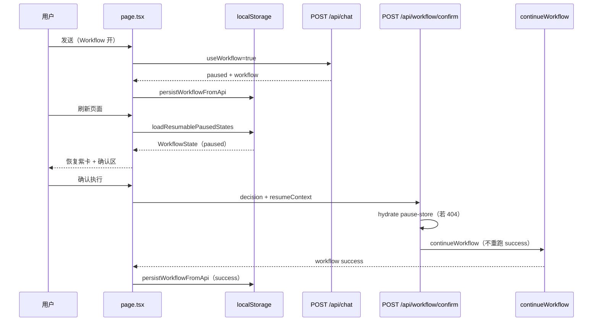

# 第19天学习总结：Workflow 持久化 + 恢复执行

对照 `ollama-chat-day18/day18_learning_summary.md` §14 学习计划，本仓库 **`ollama-chat-day19`** 在 **Conditional DAG + HITL**（第18天）之上实现了 **Workflow State Persistence**：前端 localStorage 保存完整快照，刷新后可恢复 `waiting_confirmation`，确认时 `continueWorkflow` 续跑且不重复已成功步骤。

> **下一章**：§7 为第20天「Workflow Storage 抽象 + 后端持久化雏形」学习计划（待实现）。

---

## 1. 第19天目标与能力对比

| 阶段 | 执行语义 |
|------|----------|
| 第18天 HITL | 关键步暂停 → 用户确认 → 续跑（仅进程内 pause-store） |
| **第19天 Persistent** | 每次状态变化写入 localStorage → 刷新可恢复 → confirm 带快照 hydrate 服务端 |

**核心认知：**

> Agent Runtime 不是一次性函数调用，而是一个可以暂停、保存、恢复、继续的状态机。

能力演进：

```text
第17天  Conditional DAG Runtime
第18天  Conditional DAG Runtime + HITL
第19天  Persistent Conditional DAG Runtime + HITL
```

---

## 2. 数据模型：`WorkflowState`

定义见 `lib/workflow-types.ts`：

| 字段 | 含义 |
|------|------|
| `version: 1` | 结构版本，读取时校验（任务 7） |
| `workflowId` | 与 `Workflow.id` 一致 |
| `status` | `pending` \| `running` \| `paused` \| `success` \| `failed` \| `cancelled` |
| `steps` | 完整步骤列表（含 `waiting_confirmation`） |
| `stepOutputs` | 已成功步骤 id→output（任务 1） |
| `timeline` | `WorkflowTimelineEvent[]` |
| `memory` / `memorySnapshot` | 续跑记忆闭环 |
| `paused` / `waitingStepId` | HITL UI 恢复 |
| `createdAt` / `updatedAt` | 时间戳；过期清理依据 |

---

## 3. 实现映射（对照 §14.4 任务清单）

| 任务 | 实现位置 |
|------|----------|
| 1. 设计 `WorkflowState` | `lib/workflow-types.ts` |
| 2. localStorage 持久化 | `lib/workflow-persistence.ts` |
| 3. 每次状态变化保存 | `app/page.tsx` → `persistWorkflowBubble`（chat / confirm 响应后） |
| 4. 历史 Workflow 列表 | `app/page.tsx` 右侧栏 + `listWorkflowStateSummaries` |
| 5. 恢复 paused workflow | `loadResumablePausedStates` + 挂载 `useEffect` |
| 6. `continueWorkflow`（不 replan） | `lib/workflow-executor.ts`；`confirm/route.ts` 调用 |
| 7. `version` 校验 | `loadWorkflowState` / `saveWorkflowState` |
| 8. 过期清理（7 天） | `purgeExpiredWorkflowStates`；挂载时调用 |
| 刷新后 confirm | `resumeContext` → `confirm/route.ts` hydrate `pause-store` |

---

## 4. 端到端流程（刷新场景）



---

## 5. 第19天打卡

| # | 验收项 | 结果 |
|---|--------|------|
| 1 | 是否实现 WorkflowState | **是** |
| 2 | 是否实现 localStorage 持久化 | **是** |
| 3 | 页面刷新后是否能恢复 workflow | **是** |
| 4 | waiting_confirmation 是否能恢复 | **是** |
| 5 | 已成功 step 是否不会重复执行 | **是**（`continueWorkflow` → `executeWorkflow`，success 步不入批） |
| 6 | confirm 后是否能从 paused 继续 | **是** |
| 7 | 是否实现历史 workflow 列表 | **是** |
| 8 | 是否保存 timeline / stepOutputs | **是** |
| 9 | 是否加入 version | **是** |
| 10 | 是否实现过期清理 | **是**（7 天，挂载时 purge） |

**当前系统能力：** Persistent Conditional DAG Runtime + HITL

---

## 6. 相关文件

| 文件 | 说明 |
|------|------|
| `lib/workflow-persistence.ts` | 持久化 API |
| `lib/workflow-executor.ts` | `continueWorkflow` |
| `app/page.tsx` | 恢复 UI、历史列表 |
| `app/api/workflow/confirm/route.ts` | `resumeContext` |
| `day19_test_cases.md` | 手动测试用例 |
| `ollama-chat-day18/day18_learning_summary.md` | §14 原始计划 |

---

## 7. 第20天学习计划：Workflow Storage 抽象 + 后端持久化雏形

### 7.1 今日核心目标

把 localStorage 从「写死实现」升级成「可替换存储层」，为后面接数据库做准备。

### 7.2 为什么第 20 天要做这个？

现在 Workflow 存在前端 localStorage 里。

**优点：**

- 简单
- 快
- 刷新不丢

**但问题是：**

- 换浏览器就没了
- 后端不知道 workflow 状态
- 多设备不能同步
- 未来不能做真正的任务恢复
- 不能做服务端 Agent Runtime

所以第 20 天要做 **Storage Abstraction**：

- localStorage 只是一个实现
- 未来 SQLite / PostgreSQL / Redis 也是实现

### 7.3 第 20 天最终效果

代码不要再直接写：

```ts
localStorage.setItem(...)
```

而是变成：

```ts
workflowStore.save(workflow)
workflowStore.get(workflowId)
workflowStore.list()
workflowStore.delete(workflowId)
```

这样以后要换数据库，只换 store，不动 Runtime。

### 7.4 任务清单

#### 任务 1：设计 `WorkflowStore` 接口

新建：

```ts
type WorkflowStore = {
  save(workflow: WorkflowState): Promise<void>
  get(workflowId: string): Promise<WorkflowState | null>
  list(): Promise<WorkflowState[]>
  delete(workflowId: string): Promise<void>
  purgeExpired(): Promise<void>
}
```

**核心认知：** Runtime 不应该关心数据存在哪里。

#### 任务 2：实现 `LocalWorkflowStore`

把第 19 天的 localStorage 逻辑封装进去：

```ts
class LocalWorkflowStore implements WorkflowStore {
  async save(workflow: WorkflowState) {
    workflow.updatedAt = Date.now()
    localStorage.setItem(
      `workflow:${workflow.workflowId}`,
      JSON.stringify(workflow)
    )
  }

  async get(workflowId: string) {
    const raw = localStorage.getItem(`workflow:${workflowId}`)
    return raw ? JSON.parse(raw) : null
  }

  async list() {
    const items: WorkflowState[] = []

    for (let i = 0; i < localStorage.length; i++) {
      const key = localStorage.key(i)

      if (key?.startsWith("workflow:")) {
        const raw = localStorage.getItem(key)
        if (raw) items.push(JSON.parse(raw))
      }
    }

    return items.sort((a, b) => b.updatedAt - a.updatedAt)
  }

  async delete(workflowId: string) {
    localStorage.removeItem(`workflow:${workflowId}`)
  }

  async purgeExpired() {
    const workflows = await this.list()
    const expireMs = 7 * 24 * 60 * 60 * 1000

    workflows.forEach(w => {
      if (Date.now() - w.updatedAt > expireMs) {
        localStorage.removeItem(`workflow:${w.workflowId}`)
      }
    })
  }
}
```

#### 任务 3：Runtime 改成依赖 store

之前：

```ts
saveWorkflowState(workflow)
```

升级为：

```ts
await workflowStore.save(workflow)
```

确认继续时：

```ts
const workflow = await workflowStore.get(workflowId)
await continueWorkflow(workflow)
```

#### 任务 4：增加 `BackendWorkflowStore` 雏形

今天不一定真的接数据库，先做接口雏形：

```ts
class BackendWorkflowStore implements WorkflowStore {
  async save(workflow: WorkflowState) {
    await fetch("/api/workflows", {
      method: "POST",
      body: JSON.stringify(workflow)
    })
  }

  async get(workflowId: string) {
    const res = await fetch(`/api/workflows/${workflowId}`)
    return res.json()
  }

  async list() {
    const res = await fetch("/api/workflows")
    return res.json()
  }

  async delete(workflowId: string) {
    await fetch(`/api/workflows/${workflowId}`, {
      method: "DELETE"
    })
  }

  async purgeExpired() {
    await fetch("/api/workflows/purge", {
      method: "POST"
    })
  }
}
```

#### 任务 5：实现后端 API mock

先用内存 `Map` 模拟数据库：

```ts
const workflowDb = new Map<string, WorkflowState>()
```

API：

| 方法 | 路径 |
|------|------|
| POST | `/api/workflows` |
| GET | `/api/workflows` |
| GET | `/api/workflows/:id` |
| DELETE | `/api/workflows/:id` |
| POST | `/api/workflows/purge` |

今天目的不是数据库，而是：把「前端存储」抽象成「可替换后端存储」。

#### 任务 6：前端加 store 切换

简单做一个开关：

```ts
const workflowStore =
  storageMode === "local"
    ? new LocalWorkflowStore()
    : new BackendWorkflowStore()
```

UI 显示：`Storage Mode: local / backend`

#### 任务 7：增加 store debug 日志

```ts
console.log("[WorkflowStore] save", workflow.workflowId)
console.log("[WorkflowStore] get", workflowId)
console.log("[WorkflowStore] list")
console.log("[WorkflowStore] delete", workflowId)
```

### 7.5 第 20 天验收标准

1. 是否定义 `WorkflowStore` 接口  
2. 是否实现 `LocalWorkflowStore`  
3. Runtime 是否不再直接依赖 localStorage  
4. 是否实现 `BackendWorkflowStore` 雏形  
5. 是否实现后端 mock API  
6. 是否能 list / get / save / delete workflow  
7. 是否能切换 local / backend store  
8. 是否保留 `purgeExpired`  
9. 是否增加 store debug 日志  

### 7.6 第 20 天打卡模板

```text
【第20天打卡】

1. 是否定义 WorkflowStore 接口：是 / 否
2. 是否实现 LocalWorkflowStore：是 / 否

3. Runtime 是否不再直接依赖 localStorage：是 / 否
4. 是否实现 BackendWorkflowStore：是 / 否

5. 是否实现后端 mock API：是 / 否
6. 是否支持 save / get / list / delete：是 / 否

7. 是否能切换 local / backend store：是 / 否
8. 是否保留 purgeExpired：是 / 否

9. 是否增加 WorkflowStore debug 日志：是 / 否

10. 遇到的最大问题：

11. 当前系统能力：
```

### 7.7 第 20 天核心认知

记住这句话：

> **Runtime 不应该依赖某一种存储方式，而应该依赖存储接口。**

做完第 20 天，系统会升级成：

**Persistent Conditional DAG Runtime + HITL + Pluggable Storage**

### 7.8 能力演进对照

```text
第17天  Conditional DAG Runtime
第18天  Conditional DAG Runtime + HITL
第19天  Persistent Conditional DAG Runtime + HITL
第20天  Persistent Conditional DAG Runtime + HITL + Pluggable Storage
```

---

*实现日期：2026-05-20；§1–§6 为第19天实现归纳；§7 为第20天 Storage 抽象学习计划（实现后请同步 §7.4 实现映射表与 §7.6 打卡结果）。测试步骤见 `day19_test_cases.md`。*
