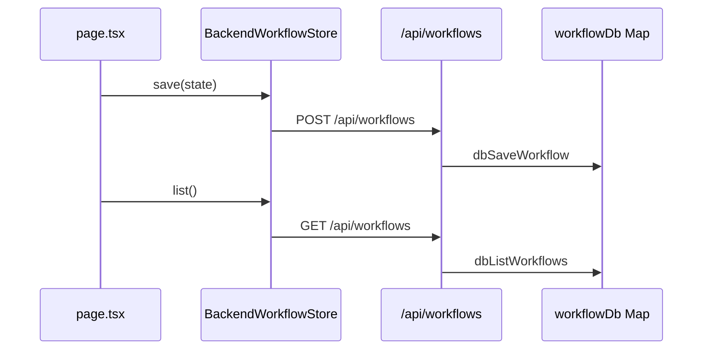

# 第20天学习总结：Workflow Storage 抽象 + 后端持久化雏形

对照 `ollama-chat-day19/day19_learning_summary.md` §7 学习计划，本仓库 **`ollama-chat-day20`** 在 **Persistent Conditional DAG + HITL**（第19天）之上实现了 **Pluggable Storage**：Runtime 与页面通过 `WorkflowStore` 读写，不再直接调用 `localStorage`；可选 `LocalWorkflowStore` 或 `BackendWorkflowStore`（服务端内存 `Map` + REST API）。

> **核心认知**：Runtime 不应该依赖某一种存储方式，而应该依赖存储接口。

---

## 1. 第20天目标与能力对比

| 阶段 | 存储语义 |
|------|----------|
| 第19天 Persistent | 写死 `localStorage.setItem` / `getItem` |
| **第20天 Pluggable** | `workflowStore.save/get/list/delete/purgeExpired`，实现可换 |

能力演进：

```text
第17天  Conditional DAG Runtime
第18天  Conditional DAG Runtime + HITL
第19天  Persistent Conditional DAG Runtime + HITL
第20天  Persistent Conditional DAG Runtime + HITL + Pluggable Storage
```

---

## 2. 数据模型与接口

### 2.1 `WorkflowStore`（任务 1）

定义见 `lib/workflow-store.ts`：

| 方法 | 含义 |
|------|------|
| `save(workflow)` | 写入或覆盖 `WorkflowState` |
| `get(workflowId)` | 按 id 读取，不存在返回 `null` |
| `list()` | 列出全部（实现方排序） |
| `delete(workflowId)` | 删除单条 |
| `purgeExpired()` | 7 天过期清理，返回删除条数 |

### 2.2 实现类

| 实现 | 文件 | 后端 |
|------|------|------|
| `LocalWorkflowStore` | `lib/local-workflow-store.ts` | 浏览器 `localStorage` + `workflow:index` |
| `BackendWorkflowStore` | `lib/backend-workflow-store.ts` | `fetch` → `/api/workflows*` |
| 服务端 DB mock | `lib/workflow-db.ts` | 进程内 `Map<string, WorkflowState>` |

### 2.3 工厂与 UI 切换（任务 6）

```ts
const workflowStore = createWorkflowStore(storageMode) // "local" | "backend"
```

页面 **Storage** 下拉 + 标题徽章 `Storage: local / backend`；偏好键 `workflow:storageMode`（meta，仍存 localStorage）。

---

## 3. 实现映射（对照 §7.4 任务清单）

| 任务 | 实现位置 |
|------|----------|
| 1. 设计 `WorkflowStore` 接口 | `lib/workflow-store.ts` |
| 2. `LocalWorkflowStore` | `lib/local-workflow-store.ts` |
| 3. Runtime/页面依赖 store | `lib/workflow-persistence.ts`、`app/page.tsx` |
| 4. `BackendWorkflowStore` 雏形 | `lib/backend-workflow-store.ts` |
| 5. 后端 mock API | `app/api/workflows/route.ts`、`[id]/route.ts`、`purge/route.ts` |
| 6. local / backend 切换 | `app/page.tsx` Storage 下拉 + `createWorkflowStore` |
| 7. store debug 日志 | `LocalWorkflowStore` / `BackendWorkflowStore` 内 `console.log("[WorkflowStore] ...")` |

---

## 4. API 一览（任务 5）

| 方法 | 路径 | 作用 |
|------|------|------|
| POST | `/api/workflows` | 保存快照 |
| GET | `/api/workflows` | 列表 |
| GET | `/api/workflows/:id` | 单条 |
| DELETE | `/api/workflows/:id` | 删除 |
| POST | `/api/workflows/purge` | 过期清理 |

---

## 5. 端到端流程（backend 模式）



local 模式与第19天行为等价，但经 `LocalWorkflowStore` 封装。

---

## 6. 第20天打卡

| # | 验收项 | 结果 |
|---|--------|------|
| 1 | 是否定义 `WorkflowStore` 接口 | **是** |
| 2 | 是否实现 `LocalWorkflowStore` | **是** |
| 3 | Runtime 是否不再直接依赖 localStorage | **是**（业务读写经 Store；仅 meta 偏好仍用 localStorage） |
| 4 | 是否实现 `BackendWorkflowStore` | **是** |
| 5 | 是否实现后端 mock API | **是** |
| 6 | 是否支持 save / get / list / delete | **是** |
| 7 | 是否能切换 local / backend store | **是** |
| 8 | 是否保留 `purgeExpired` | **是** |
| 9 | 是否增加 WorkflowStore debug 日志 | **是** |

**当前系统能力：** Persistent Conditional DAG Runtime + HITL + Pluggable Storage

---

## 7. 相关文件

| 文件 | 说明 |
|------|------|
| `lib/workflow-store.ts` | 接口 + `createWorkflowStore` |
| `lib/local-workflow-store.ts` | 浏览器实现 |
| `lib/backend-workflow-store.ts` | HTTP 实现 |
| `lib/workflow-db.ts` | 服务端 Map |
| `lib/workflow-persistence.ts` | build/summary/恢复（接受 `WorkflowStore`） |
| `app/page.tsx` | Storage 切换 + 异步持久化 |
| `day20_test_cases.md` | 第1–20天测试用例汇总 |
| `ollama-chat-day19/day19_learning_summary.md` | 第19天与 §7 原始计划 |

---

*实现日期：2026-05-20；测试步骤见 `day20_test_cases.md`。*
