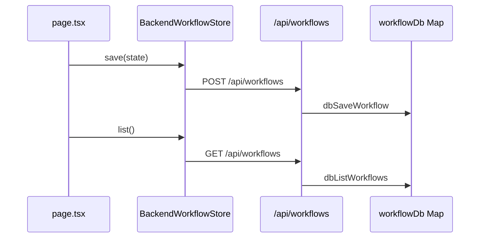

# 第20天学习总结：Workflow Storage 抽象 + 后端持久化雏形

对照 `ollama-chat-day19/day19_learning_summary.md` §7 学习计划，本仓库 **`ollama-chat-day20`** 在 **Persistent Conditional DAG + HITL**（第19天）之上实现了 **Pluggable Storage**：Runtime 与页面通过 `WorkflowStore` 读写，不再直接调用 `localStorage`；可选 `LocalWorkflowStore` 或 `BackendWorkflowStore`（服务端内存 `Map` + REST API）。

> **核心认知**：Runtime 不应该依赖某一种存储方式，而应该依赖存储接口。

---

## 1. 第20天目标与能力对比

| 阶段 | 存储语义 |
|------|----------|
| 第19天 Persistent | 写死 `localStorage.setItem` / `getItem` |
| **第20天 Pluggable** | `workflowStore.save/get/list/delete/purgeExpired`，实现可换 |
| 第21天 MySQL（计划） | 后端 `Map` mock → `MySQLWorkflowStore`，重启不丢数据 |

能力演进：

```text
第17天  Conditional DAG Runtime
第18天  Conditional DAG Runtime + HITL
第19天  Persistent Conditional DAG Runtime + HITL
第20天  Persistent Conditional DAG Runtime + HITL + Pluggable Storage
第21天  … + MySQL 持久化（见 §8）
```

---

## 2. 数据模型与接口

### 2.1 `WorkflowStore`（任务 1）

定义见 `lib/workflow-store.ts`：

| 方法 | 含义 |
|------|------|
| `save(workflow)` | 写入或覆盖 `WorkflowState` |
| `get(workflowId)` | 按 id 读取，不存在返回 `null` |
| `list()` | 列出全部（实现方排序） |
| `delete(workflowId)` | 删除单条 |
| `purgeExpired()` | 7 天过期清理，返回删除条数 |

### 2.2 实现类

| 实现 | 文件 | 后端 |
|------|------|------|
| `LocalWorkflowStore` | `lib/local-workflow-store.ts` | 浏览器 `localStorage` + `workflow:index` |
| `BackendWorkflowStore` | `lib/backend-workflow-store.ts` | `fetch` → `/api/workflows*` |
| 服务端 DB mock | `lib/workflow-db.ts` | 进程内 `Map<string, WorkflowState>` |

### 2.3 工厂与 UI 切换（任务 6）

```ts
const workflowStore = createWorkflowStore(storageMode) // "local" | "backend"
```

页面 **Storage** 下拉 + 标题徽章 `Storage: local / backend`；偏好键 `workflow:storageMode`（meta，仍存 localStorage）。

---

## 3. 实现映射（对照 §7.4 任务清单）

| 任务 | 实现位置 |
|------|----------|
| 1. 设计 `WorkflowStore` 接口 | `lib/workflow-store.ts` |
| 2. `LocalWorkflowStore` | `lib/local-workflow-store.ts` |
| 3. Runtime/页面依赖 store | `lib/workflow-persistence.ts`、`app/page.tsx` |
| 4. `BackendWorkflowStore` 雏形 | `lib/backend-workflow-store.ts` |
| 5. 后端 mock API | `app/api/workflows/route.ts`、`[id]/route.ts`、`purge/route.ts` |
| 6. local / backend 切换 | `app/page.tsx` Storage 下拉 + `createWorkflowStore` |
| 7. store debug 日志 | `LocalWorkflowStore` / `BackendWorkflowStore` 内 `console.log("[WorkflowStore] ...")` |

---

## 4. API 一览（任务 5）

| 方法 | 路径 | 作用 |
|------|------|------|
| POST | `/api/workflows` | 保存快照 |
| GET | `/api/workflows` | 列表 |
| GET | `/api/workflows/:id` | 单条 |
| DELETE | `/api/workflows/:id` | 删除 |
| POST | `/api/workflows/purge` | 过期清理 |

---

## 5. 端到端流程（backend 模式）



local 模式与第19天行为等价，但经 `LocalWorkflowStore` 封装。

---

## 6. 第20天打卡

| # | 验收项 | 结果 |
|---|--------|------|
| 1 | 是否定义 `WorkflowStore` 接口 | **是** |
| 2 | 是否实现 `LocalWorkflowStore` | **是** |
| 3 | Runtime 是否不再直接依赖 localStorage | **是**（业务读写经 Store；仅 meta 偏好仍用 localStorage） |
| 4 | 是否实现 `BackendWorkflowStore` | **是** |
| 5 | 是否实现后端 mock API | **是** |
| 6 | 是否支持 save / get / list / delete | **是** |
| 7 | 是否能切换 local / backend store | **是** |
| 8 | 是否保留 `purgeExpired` | **是** |
| 9 | 是否增加 WorkflowStore debug 日志 | **是** |

**当前系统能力：** Persistent Conditional DAG Runtime + HITL + Pluggable Storage

---

## 7. 相关文件

| 文件 | 说明 |
|------|------|
| `lib/workflow-store.ts` | 接口 + `createWorkflowStore` |
| `lib/local-workflow-store.ts` | 浏览器实现 |
| `lib/backend-workflow-store.ts` | HTTP 实现 |
| `lib/workflow-db.ts` | 服务端 Map |
| `lib/workflow-persistence.ts` | build/summary/恢复（接受 `WorkflowStore`） |
| `app/page.tsx` | Storage 切换 + 异步持久化 |
| `day20_test_cases.md` | 第1–20天测试用例汇总 |
| `ollama-chat-day19/day19_learning_summary.md` | 第19天与 §7 原始计划 |

---

## 8. 第21天学习计划：MySQL 持久化 Workflow

### 8.1 核心目标

把后端 mock store（`lib/workflow-db.ts` 进程内 `Map`）换成真正的 **MySQL** 存储。

> **核心认知**：第20天已把存储抽象成接口；第21天只换服务端实现，**`BackendWorkflowStore` 与前端 API 路径基本不用改**。

能力演进（完成后）：

```text
第20天  Persistent Conditional DAG Runtime + HITL + Pluggable Storage（后端 Map mock）
第21天  Persistent Conditional DAG Runtime + HITL + Pluggable Storage + MySQL 持久化
```

### 8.2 实现顺序

#### 1. 安装依赖

```bash
npm install mysql2
```

#### 2. 配置 `.env.local`

```env
MYSQL_HOST=localhost
MYSQL_PORT=3306
MYSQL_USER=root
MYSQL_PASSWORD=你的密码
MYSQL_DATABASE=agent_runtime
```

#### 3. 创建数据库

```sql
CREATE DATABASE agent_runtime CHARACTER SET utf8mb4 COLLATE utf8mb4_unicode_ci;
```

#### 4. 创建 `workflows` 表

```sql
CREATE TABLE workflows (
  id VARCHAR(64) PRIMARY KEY,
  goal TEXT NOT NULL,
  status VARCHAR(32) NOT NULL,
  version INT NOT NULL DEFAULT 1,

  steps JSON NOT NULL,
  step_outputs JSON NOT NULL,
  timeline JSON NOT NULL,
  memory_snapshot JSON NULL,

  created_at TIMESTAMP DEFAULT CURRENT_TIMESTAMP,
  updated_at TIMESTAMP DEFAULT CURRENT_TIMESTAMP ON UPDATE CURRENT_TIMESTAMP
);
```

#### 5. 新建 MySQL 连接池

文件：`lib/mysql.ts`（仅服务端 import）

```ts
import mysql from "mysql2/promise";

export const pool = mysql.createPool({
  host: process.env.MYSQL_HOST,
  port: Number(process.env.MYSQL_PORT || 3306),
  user: process.env.MYSQL_USER,
  password: process.env.MYSQL_PASSWORD,
  database: process.env.MYSQL_DATABASE,
  waitForConnections: true,
  connectionLimit: 10,
});
```

#### 6. 实现 `MySQLWorkflowStore`

文件：`lib/mysql-workflow-store.ts`（或 `lib/workflow/mysql-workflow-store.ts`）

| 方法 | 含义 |
|------|------|
| `save(workflow)` | `INSERT ... ON DUPLICATE KEY UPDATE` |
| `get(workflowId)` | `SELECT * WHERE id = ?`，无行返回 `null` |
| `list()` | `ORDER BY updated_at DESC` |
| `delete(workflowId)` | `DELETE WHERE id = ?` |
| `purgeExpired()` | `DELETE WHERE updated_at < DATE_SUB(NOW(), INTERVAL 7 DAY)` |

`toWorkflowState(row)` 需处理 JSON 列：MySQL 驱动可能返回 `string` 或已解析对象，对 `steps` / `step_outputs` / `timeline` / `memory_snapshot` 做 `typeof === "string" ? JSON.parse(...) : ...`；`createdAt` / `updatedAt` 用 `new Date(row.created_at).getTime()`。

核心 SQL（`save`）：

```ts
await pool.execute(
  `
  INSERT INTO workflows
  (id, goal, status, version, steps, step_outputs, timeline, memory_snapshot)
  VALUES (?, ?, ?, ?, ?, ?, ?, ?)
  ON DUPLICATE KEY UPDATE
    goal = VALUES(goal),
    status = VALUES(status),
    version = VALUES(version),
    steps = VALUES(steps),
    step_outputs = VALUES(step_outputs),
    timeline = VALUES(timeline),
    memory_snapshot = VALUES(memory_snapshot)
  `,
  [
    workflow.workflowId,
    workflow.goal,
    workflow.status,
    workflow.version,
    JSON.stringify(workflow.steps),
    JSON.stringify(workflow.stepOutputs),
    JSON.stringify(workflow.timeline),
    JSON.stringify(workflow.memorySnapshot ?? []),
  ]
);
```

字段映射：`workflowId` ↔ 表列 `id`；`stepOutputs` ↔ `step_outputs`；`memorySnapshot` ↔ `memory_snapshot`。

#### 7. 替换后端 store

在 `app/api/workflows/route.ts`、`[id]/route.ts`、`purge/route.ts` 中，将 `workflow-db.ts` 的 `dbSaveWorkflow` / `dbGetWorkflow` 等调用改为 `MySQLWorkflowStore` 实例方法（或让 `workflow-db.ts` 内部委托给 `MySQLWorkflowStore`，保持 API Route 薄层）。

```ts
const workflowStore = new MySQLWorkflowStore();
// workflowStore.save / get / list / delete / purgeExpired
```

前端 `BackendWorkflowStore`（`lib/backend-workflow-store.ts`）**基本不用改**，仍走 `/api/workflows*`。

### 8.3 任务清单与文件映射（待实现）

| 任务 | 目标文件 |
|------|----------|
| 安装 `mysql2` | `package.json` |
| 环境变量 | `.env.local` |
| 连接池 | `lib/mysql.ts` |
| `MySQLWorkflowStore` | `lib/mysql-workflow-store.ts` |
| 替换 Map mock | `lib/workflow-db.ts` 或各 `app/api/workflows/*` |
| 验收：重启后数据仍在 | 手动重启 `next dev` 后 GET 列表 |

### 8.4 第21天打卡模板

```text
【第21天打卡】

1. 是否安装 mysql2：是 / 否
2. 是否创建 MySQL 数据库：是 / 否
3. 是否创建 workflows 表：是 / 否

4. 是否实现 mysql pool：是 / 否
5. 是否实现 MySQLWorkflowStore：是 / 否

6. 是否替换后端 mock store：是 / 否
7. 是否支持 save / get / list / delete：是 / 否

8. 服务重启后 workflow 是否仍存在：是 / 否
9. purgeExpired 是否正常：是 / 否

10. 遇到的最大问题：

11. 当前系统能力：
```

---

*实现日期：2026-05-20（第20天）；第21天计划见 §8；测试步骤见 `day20_test_cases.md`。*
