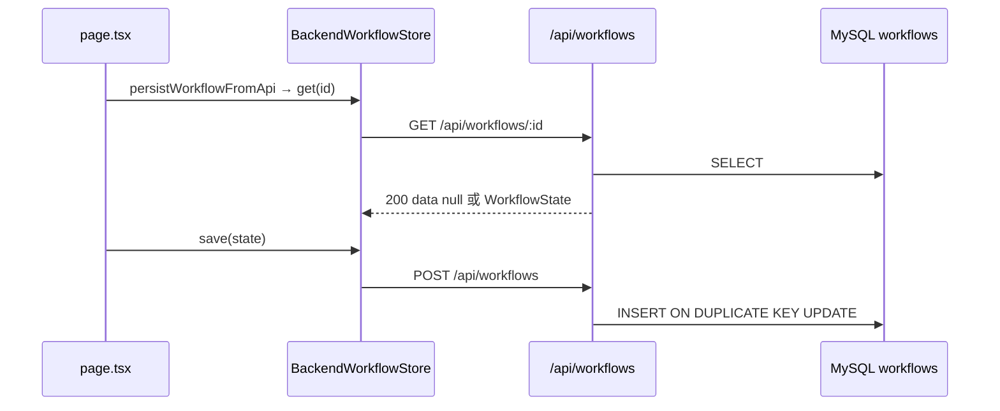

# 第21天学习总结：MySQL 持久化 + 统一 API 响应包

对照 `ollama-chat-day20/day20_learning_summary.md` §8 学习计划，本仓库 **`ollama-chat-day21`** 在 day20 **Pluggable Storage** 之上完成两项工程化升级：

1. 将后端 **`Map` mock** 替换为 **MySQL** 存储（重启 `next dev` 不丢 workflow）。
2. 将全部 `/api/*` 收口为 **`{ ok, code, data, msg }`** 响应包，避免「查无记录」用 HTTP 404 导致 DevTools 误报。

> **下一章**：§8 为第22天「Workflow 持久化 upsert 优化」学习计划（待实现）。

---

## 1. 第21天目标与能力对比

| 阶段 | 存储 / API 语义 |
|------|-----------------|
| 第20天 Pluggable | `WorkflowStore` 接口；backend 走进程内 `Map` + 裸 JSON 数组/404 |
| **第21天 MySQL** | `MySQLWorkflowStore` + `extra_json` 保留 HITL 字段；重启后数据仍在 |
| **第21天 Envelope** | HTTP 200 + `data` 区分有无；真错误仍 400/500/502 |

能力演进：

```text
第17天  Conditional DAG Runtime
第18天  Conditional DAG Runtime + HITL
第19天  Persistent Conditional DAG Runtime + HITL
第20天  Persistent Conditional DAG Runtime + HITL + Pluggable Storage（后端 Map mock）
第21天  … + MySQL 持久化 + 统一 API 响应包
第22天  … + 服务端 upsert 保留 createdAt（见 §8，计划）
```

---

## 2. 核心认知

### 2.1 MySQL：只换服务端实现

第20天已抽象 `WorkflowStore`；第21天 **只换服务端实现**：

- `BackendWorkflowStore`（`lib/backend-workflow-store.ts`）**API 路径不变**
- `app/api/workflows/*` 内部改为 `MySQLWorkflowStore`（经 `workflow-db.ts` 委托）
- `local` 模式仍走 `LocalWorkflowStore` + `localStorage`

### 2.2 Envelope：HTTP 与业务结果分层

**问题**：`persistWorkflowFromApi` 保存前会 `store.get(id)` 以保留 `createdAt`；首次保存时库里无记录，旧实现返回 **HTTP 404**，Network 面板标红，易被误判为故障。

**原则**：

| HTTP | 何时用 |
|------|--------|
| **200** | 请求格式合法、服务端逻辑跑完（含：查无记录、DELETE 目标本就不存在） |
| **400** | 参数 / JSON / version 不合法 |
| **500 / 502 / 503** | DB 异常、模型上游失败、密钥未配置等 |

**查无记录**（GET 单条）：`200 + { ok: true, code: 200, data: null, msg: "not found" }`  
**查到了**：`200 + { ok: true, code: 200, data: WorkflowState, msg: "success" }`  
**真失败**：`{ ok: false, code: <与 HTTP 一致>, data: null, msg: "..." }`

客户端：`readApiDataOrNull` — `data === null` 返回 `null`，不抛错。

---

## 3. MySQL 实现清单

| 任务 | 文件 | 状态 |
|------|------|------|
| 安装 `mysql2` | `package.json` | ✅ |
| 环境变量 | `.env.example` → `.env.local` | ✅ |
| 建库建表 | `scripts/init-mysql.sql` | ✅ |
| 连接池 | `lib/mysql.ts` | ✅ |
| `MySQLWorkflowStore` | `lib/mysql-workflow-store.ts` | ✅ |
| 替换 Map mock | `lib/workflow-db.ts` 委托 | ✅ |
| API 异步 + 错误处理 | `app/api/workflows/*` | ✅ |

### 3.1 表结构说明

学习计划中的 `workflows` 表已实现；另增 **`extra_json`** 列，用于存放 day20 Map 中的 HITL 扩展字段（`paused`、`waitingStepId`、`memory`、`executionBatches` 等），避免 confirm 续跑能力退化。

字段映射：`workflowId` ↔ `id`；`stepOutputs` ↔ `step_outputs`；`memorySnapshot` ↔ `memory_snapshot`。

`save` 使用 `INSERT ... ON DUPLICATE KEY UPDATE`；`purgeExpired` 使用 `DELETE ... INTERVAL 7 DAY`。

---

## 4. 统一 API 响应包实现清单

| 任务 | 文件 | 状态 |
|------|------|------|
| `API_CODE` / `API_MSG` / `API_REASON` 查表 | `lib/api-envelope.ts` | ✅ |
| `apiJsonSuccess` / `apiJsonGetMiss` / `apiJsonReasonError` / `apiJsonFailOk` | `lib/api-envelope.ts` | ✅ |
| 客户端 `readApiData` / `readApiDataOrNull` / `assertApiOk` | `lib/api-envelope.ts`、`lib/api-client.ts` | ✅ |
| Workflow CRUD API | `app/api/workflows/*` | ✅ |
| Chat / Confirm API | `app/api/chat/route.ts`、`app/api/workflow/confirm/route.ts` | ✅ |
| `BackendWorkflowStore` 解析 envelope | `lib/backend-workflow-store.ts` | ✅ |

### 4.1 辅助函数速查

| 函数 | 用途 |
|------|------|
| `apiJsonSuccess(data, msg?)` | 成功，HTTP 200，`ok: true` |
| `apiJsonGetMiss()` | GET 单条无记录：200，`data: null`，`msg: "not found"` |
| `apiJsonReasonError(API_REASON.*)` | 真错误：HTTP 与 `code` 一致，`ok: false` |
| `apiJsonFailOk(code, msg)` | HTTP 200 但 `ok: false`（如 confirm 找不到暂停上下文） |

### 4.2 各路由响应约定

| 路由 | 成功体 | 特殊约定 |
|------|--------|----------|
| `GET /api/workflows/:id` | `data: WorkflowState` 或 `null` | 无记录仍 **200** |
| `GET /api/workflows` | `data: WorkflowState[]` | 空数组 `[]`，不是 `null` |
| `POST /api/workflows` | `data: { workflowId }` | |
| `DELETE /api/workflows/:id` | `data: { workflowId, deleted: boolean }` | 不存在也 200 |
| `POST /api/workflows/purge` | `data: { removed: number }` | |
| `POST /api/chat` | `data: ChatApiResult` | 校验失败 400 |
| `POST /api/workflow/confirm` | `data: ConfirmResult` | 无暂停上下文：`apiJsonFailOk` |

---

## 5. 端到端流程（backend 模式 + 持久化）



`handleSend` 在返回 `type: "workflow"` 时触发上述链路；**GET 无记录为预期路径**（保留 `createdAt` 的 read-merge-write），不应再出现红色 404。

---

## 6. 第21天打卡

| # | 验收项 | 结果 |
|---|--------|------|
| 1 | 是否安装 mysql2 | **是** |
| 2 | 是否创建 MySQL 数据库 / workflows 表 | **是**（见 `scripts/init-mysql.sql`） |
| 3 | 是否实现 mysql pool | **是**（`lib/mysql.ts`） |
| 4 | 是否实现 MySQLWorkflowStore | **是** |
| 5 | 是否替换后端 mock store | **是**（`lib/workflow-db.ts`） |
| 6 | 是否支持 save / get / list / delete / purgeExpired | **是** |
| 7 | 服务重启后 workflow 是否仍存在 | **是**（backend + MySQL 已连接时） |
| 8 | 是否实现统一 API 响应包 | **是**（`lib/api-envelope.ts`） |
| 9 | GET 无记录是否 HTTP 200 + `data: null` | **是** |
| 10 | 全部 `/api/*` 是否已包 envelope | **是** |

**当前系统能力：**

```text
Persistent Conditional DAG Runtime + HITL + Pluggable Storage + MySQL 持久化 + 统一 API 响应包
```

```text
【第21天打卡】

1. 是否安装 mysql2：是
2. 是否创建 MySQL 数据库：需本地执行 init-mysql.sql
3. 是否创建 workflows 表：是（含 extra_json）

4. 是否实现 mysql pool：是
5. 是否实现 MySQLWorkflowStore：是

6. 是否替换后端 mock store：是
7. 是否支持 save / get / list / delete：是

8. 服务重启后 workflow 是否仍存在：backend 模式下应仍在
9. purgeExpired 是否正常：是

10. 是否统一 API 响应包：是
11. GET 无记录是否 200 + data null：是

12. 遇到的最大问题：（自填）

13. 当前系统能力：
Persistent Conditional DAG Runtime + HITL + Pluggable Storage + MySQL 持久化 + 统一 API 响应包
```

---

## 7. 相关文件

| 文件 | 说明 |
|------|------|
| `lib/mysql.ts` | 连接池 |
| `lib/mysql-workflow-store.ts` | CRUD + purge + `toWorkflowState` |
| `lib/workflow-db.ts` | API 层委托 MySQL |
| `lib/api-envelope.ts` | 响应包类型与辅助函数 |
| `lib/api-client.ts` | 浏览器端 re-export 解析函数 |
| `lib/backend-workflow-store.ts` | fetch + envelope 解析 |
| `lib/workflow-persistence.ts` | `persistWorkflowFromApi`（先 get 再 save） |
| `app/api/workflows/*` | REST + envelope |
| `app/api/chat/route.ts` | 聊天入口 |
| `app/api/workflow/confirm/route.ts` | HITL 确认 |
| `scripts/init-mysql.sql` | 建库建表 |
| `day21_test_cases.md` | 测试用例（含 envelope 验收） |
| `ollama-chat-day20/day20_learning_summary.md` | 第20天与 §8 原始 MySQL 计划 |

---

## 8. 第22天学习计划：Workflow 持久化 Upsert 优化

### 8.1 核心目标

在 day21 **MySQL + Envelope** 已稳定的前提下，优化 **`persistWorkflowFromApi` 的「先 GET 再 POST」** 模式：由服务端 **upsert 时保留 `created_at`**，前端保存 workflow 时 **可省略预读 GET**，减少一次 Network 请求，同时保持侧栏「创建时间」正确。

> **核心认知**：day21 的 GET 并非「校验数据库有没有数据」，而是 read-merge-write 读旧 `createdAt`；day22 把该语义下沉到 **SQL / API 契约**，而不是每次多打一条 GET。

能力演进（完成后）：

```text
第21天  … + MySQL + Envelope（保存前可能 GET 一次）
第22天  … + 服务端 upsert 保留 createdAt（保存可仅 POST 一次）
```

### 8.2 实现顺序

#### 1. 扩展 `POST /api/workflows` 语义

- `INSERT ... ON DUPLICATE KEY UPDATE` 时：**仅在新插入行**写入 `created_at`；更新行 **不覆盖** `created_at`（MySQL 默认 `ON DUPLICATE KEY UPDATE` 若不写 `created_at` 则保留原值）。
- 核对 `MySQLWorkflowStore.save`：确认 UPDATE 分支未误改 `created_at`。
- 响应仍为 envelope：`{ ok: true, data: { workflowId, created: boolean } }`（可选字段，便于调试）。

#### 2. 调整 `persistWorkflowFromApi`（或新增 `persistWorkflowFromApiFast`）

```ts
// 伪代码：backend 模式可不再 await store.get
await saveWorkflowState(store, buildWorkflowState({ ... })); // createdAt 由 DB 或响应带回
```

- **local 模式**：可保持现有逻辑（localStorage 无 DB 级 `created_at` 列）。
- **backend 模式**：去掉 `store.get`；保存后若 UI 需要 `createdAt`，从 POST 响应或随后 list 刷新侧栏。

#### 3. （可选）Chat / Confirm 响应携带 `createdAt`

- `/api/chat` 返回 `type: "workflow"` 时，若 workflow 为新建，附带 `workflowCreatedAt`。
- 前端 `buildWorkflowState` 优先用 API 下发的 `existingCreatedAt`，与 §8.2 方案互补。

#### 4. 验收与测试

- backend 模式：触发 workflow 保存，Network **仅见 POST**（无前置 GET `:id`）。
- 同一 `workflowId` 二次保存：`createdAt` 不变，`updatedAt` 刷新。
- 重启 dev 后 `createdAt` 与 MySQL `created_at` 一致。
- 在 `day22_test_cases.md` 补充 TC-22-01 ~ TC-22-03。

### 8.3 任务清单与文件映射（待实现）

| 任务 | 目标文件 |
|------|----------|
| SQL upsert 保留 `created_at` | `lib/mysql-workflow-store.ts` |
| POST 响应可选 `created` 标记 | `app/api/workflows/route.ts` |
| 去掉 backend 保存前 GET | `lib/workflow-persistence.ts` |
| 页面 / Store 适配 | `lib/backend-workflow-store.ts`、`app/page.tsx`（若需） |
| 第22天测试文档 | `day22_test_cases.md`（新建于 day22 项目或本仓库续写） |

### 8.4 第22天打卡模板

```text
【第22天打卡】

1. upsert 是否保留原 created_at：是 / 否
2. backend 保存是否不再先发 GET：是 / 否
3. 二次保存 createdAt 是否不变：是 / 否
4. 重启后 createdAt 是否与库一致：是 / 否
5. local 模式行为是否未破坏：是 / 否

6. 遇到的最大问题：

7. 当前系统能力：
```

---

*实现日期：2026-05-21（第21天 MySQL + Envelope）；第22天计划见 §8；测试步骤见 `day21_test_cases.md`。*
