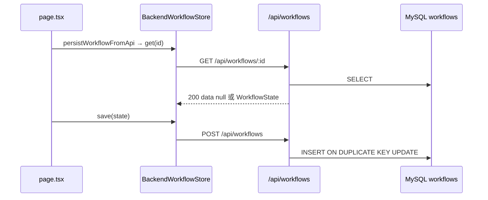

# 第21天学习总结：MySQL 持久化 + 统一 API 响应包

对照 `ollama-chat-day20/day20_learning_summary.md` §8 学习计划，本仓库 **`ollama-chat-day21`** 在 day20 **Pluggable Storage** 之上完成两项工程化升级：

1. 将后端 **`Map` mock** 替换为 **MySQL** 存储（重启 `next dev` 不丢 workflow）。
2. 将全部 `/api/*` 收口为 **`{ ok, code, data, msg }`** 响应包，避免「查无记录」用 HTTP 404 导致 DevTools 误报。

> **下一章**：§8 为第21天能力跃迁总结；§9 为第22天「Tool Registry + 动态工具系统」学习计划。  
> **说明**：`ollama-chat-day22` 已先完成「Workflow 持久化 Upsert 优化」，见 `ollama-chat-day22/day22_learning_summary.md`；§9 为下一阶段核心课纲。

---

## 1. 第21天目标与能力对比

| 阶段 | 存储 / API 语义 |
|------|-----------------|
| 第20天 Pluggable | `WorkflowStore` 接口；backend 走进程内 `Map` + 裸 JSON 数组/404 |
| **第21天 MySQL** | `MySQLWorkflowStore` + `extra_json` 保留 HITL 字段；重启后数据仍在 |
| **第21天 Envelope** | HTTP 200 + `data` 区分有无；真错误仍 400/500/502 |

能力演进：

```text
第17天  Conditional DAG Runtime
第18天  Conditional DAG Runtime + HITL
第19天  Persistent Conditional DAG Runtime + HITL
第20天  Persistent Conditional DAG Runtime + HITL + Pluggable Storage（后端 Map mock）
第21天  … + MySQL 持久化 + 统一 API 响应包
第22天  … + Upsert 保留 createdAt（`ollama-chat-day22` 已实现）+ Tool Registry（见 §9，计划）
```

---

## 2. 核心认知

### 2.1 MySQL：只换服务端实现

第20天已抽象 `WorkflowStore`；第21天 **只换服务端实现**：

- `BackendWorkflowStore`（`lib/backend-workflow-store.ts`）**API 路径不变**
- `app/api/workflows/*` 内部改为 `MySQLWorkflowStore`（经 `workflow-db.ts` 委托）
- `local` 模式仍走 `LocalWorkflowStore` + `localStorage`

### 2.2 Envelope：HTTP 与业务结果分层

**问题**：`persistWorkflowFromApi` 保存前会 `store.get(id)` 以保留 `createdAt`；首次保存时库里无记录，旧实现返回 **HTTP 404**，Network 面板标红，易被误判为故障。

**原则**：

| HTTP | 何时用 |
|------|--------|
| **200** | 请求格式合法、服务端逻辑跑完（含：查无记录、DELETE 目标本就不存在） |
| **400** | 参数 / JSON / version 不合法 |
| **500 / 502 / 503** | DB 异常、模型上游失败、密钥未配置等 |

**查无记录**（GET 单条）：`200 + { ok: true, code: 200, data: null, msg: "not found" }`  
**查到了**：`200 + { ok: true, code: 200, data: WorkflowState, msg: "success" }`  
**真失败**：`{ ok: false, code: <与 HTTP 一致>, data: null, msg: "..." }`

客户端：`readApiDataOrNull` — `data === null` 返回 `null`，不抛错。

---

## 3. MySQL 实现清单

| 任务 | 文件 | 状态 |
|------|------|------|
| 安装 `mysql2` | `package.json` | ✅ |
| 环境变量 | `.env.example` → `.env.local` | ✅ |
| 建库建表 | `scripts/init-mysql.sql` | ✅ |
| 连接池 | `lib/mysql.ts` | ✅ |
| `MySQLWorkflowStore` | `lib/mysql-workflow-store.ts` | ✅ |
| 替换 Map mock | `lib/workflow-db.ts` 委托 | ✅ |
| API 异步 + 错误处理 | `app/api/workflows/*` | ✅ |

### 3.1 表结构说明

学习计划中的 `workflows` 表已实现；另增 **`extra_json`** 列，用于存放 day20 Map 中的 HITL 扩展字段（`paused`、`waitingStepId`、`memory`、`executionBatches` 等），避免 confirm 续跑能力退化。

字段映射：`workflowId` ↔ `id`；`stepOutputs` ↔ `step_outputs`；`memorySnapshot` ↔ `memory_snapshot`。

`save` 使用 `INSERT ... ON DUPLICATE KEY UPDATE`；`purgeExpired` 使用 `DELETE ... INTERVAL 7 DAY`。

---

## 4. 统一 API 响应包实现清单

| 任务 | 文件 | 状态 |
|------|------|------|
| `API_CODE` / `API_MSG` / `API_REASON` 查表 | `lib/api-envelope.ts` | ✅ |
| `apiJsonSuccess` / `apiJsonGetMiss` / `apiJsonReasonError` / `apiJsonFailOk` | `lib/api-envelope.ts` | ✅ |
| 客户端 `readApiData` / `readApiDataOrNull` / `assertApiOk` | `lib/api-envelope.ts`、`lib/api-client.ts` | ✅ |
| Workflow CRUD API | `app/api/workflows/*` | ✅ |
| Chat / Confirm API | `app/api/chat/route.ts`、`app/api/workflow/confirm/route.ts` | ✅ |
| `BackendWorkflowStore` 解析 envelope | `lib/backend-workflow-store.ts` | ✅ |

### 4.1 辅助函数速查

| 函数 | 用途 |
|------|------|
| `apiJsonSuccess(data, msg?)` | 成功，HTTP 200，`ok: true` |
| `apiJsonGetMiss()` | GET 单条无记录：200，`data: null`，`msg: "not found"` |
| `apiJsonReasonError(API_REASON.*)` | 真错误：HTTP 与 `code` 一致，`ok: false` |
| `apiJsonFailOk(code, msg)` | HTTP 200 但 `ok: false`（如 confirm 找不到暂停上下文） |

### 4.2 各路由响应约定

| 路由 | 成功体 | 特殊约定 |
|------|--------|----------|
| `GET /api/workflows/:id` | `data: WorkflowState` 或 `null` | 无记录仍 **200** |
| `GET /api/workflows` | `data: WorkflowState[]` | 空数组 `[]`，不是 `null` |
| `POST /api/workflows` | `data: { workflowId }` | |
| `DELETE /api/workflows/:id` | `data: { workflowId, deleted: boolean }` | 不存在也 200 |
| `POST /api/workflows/purge` | `data: { removed: number }` | |
| `POST /api/chat` | `data: ChatApiResult` | 校验失败 400 |
| `POST /api/workflow/confirm` | `data: ConfirmResult` | 无暂停上下文：`apiJsonFailOk` |

---

## 5. 端到端流程（backend 模式 + 持久化）



`handleSend` 在返回 `type: "workflow"` 时触发上述链路；**GET 无记录为预期路径**（保留 `createdAt` 的 read-merge-write），不应再出现红色 404。

---

## 6. 第21天打卡

| # | 验收项 | 结果 |
|---|--------|------|
| 1 | 是否安装 mysql2 | **是** |
| 2 | 是否创建 MySQL 数据库 / workflows 表 | **是**（见 `scripts/init-mysql.sql`） |
| 3 | 是否实现 mysql pool | **是**（`lib/mysql.ts`） |
| 4 | 是否实现 MySQLWorkflowStore | **是** |
| 5 | 是否替换后端 mock store | **是**（`lib/workflow-db.ts`） |
| 6 | 是否支持 save / get / list / delete / purgeExpired | **是** |
| 7 | 服务重启后 workflow 是否仍存在 | **是**（backend + MySQL 已连接时） |
| 8 | 是否实现统一 API 响应包 | **是**（`lib/api-envelope.ts`） |
| 9 | GET 无记录是否 HTTP 200 + `data: null` | **是** |
| 10 | 全部 `/api/*` 是否已包 envelope | **是** |

**当前系统能力：**

```text
Persistent Conditional DAG Runtime + HITL + Pluggable Storage + MySQL 持久化 + 统一 API 响应包
```

```text
【第21天打卡】

1. 是否安装 mysql2：是
2. 是否创建 MySQL 数据库：需本地执行 init-mysql.sql
3. 是否创建 workflows 表：是（含 extra_json）

4. 是否实现 mysql pool：是
5. 是否实现 MySQLWorkflowStore：是

6. 是否替换后端 mock store：是
7. 是否支持 save / get / list / delete：是

8. 服务重启后 workflow 是否仍存在：backend 模式下应仍在
9. purgeExpired 是否正常：是

10. 是否统一 API 响应包：是
11. GET 无记录是否 200 + data null：是

12. 遇到的最大问题：（自填）

13. 当前系统能力：
Persistent Conditional DAG Runtime + HITL + Pluggable Storage + MySQL 持久化 + 统一 API 响应包
```

---

## 7. 第21天总结：从 Demo Runtime 到真实后端 Runtime

第 21 天已经真正完成从 **「Demo Runtime」** 进入 **「真实后端 Runtime」** 的跃迁。

### 7.1 你现在拥有的能力

| 能力 | 说明 |
|------|------|
| MySQL 持久化 | workflow 写入数据库，不再依赖进程内 Map |
| WorkflowStore 抽象 | 存储层可插拔，Runtime 不绑定具体实现 |
| Backend Store | 浏览器经 API 访问服务端存储 |
| 可恢复 Workflow | HITL 暂停 / 续跑状态可落库 |
| 服务重启后状态不丢 | `next dev` 重启后 workflow 仍在 |
| Runtime 与存储解耦 | 执行逻辑与 MySQL / local 实现分离 |

### 7.2 核心认知

你的 Agent Runtime **已经不是「浏览器玩具」**，而是：

- 一个真正 **后端驱动** 的 Agent Runtime
- 具备 **Persistent Conditional DAG Runtime + HITL + Pluggable Storage + MySQL + 统一 API 响应包**

```text
【第21天能力跃迁】

Demo Runtime（内存 / 浏览器）
        ↓
真实后端 Runtime（MySQL + WorkflowStore + Envelope）
```

---

## 8. 相关文件

| 文件 | 说明 |
|------|------|
| `lib/mysql.ts` | 连接池 |
| `lib/mysql-workflow-store.ts` | CRUD + purge + `toWorkflowState` |
| `lib/workflow-db.ts` | API 层委托 MySQL |
| `lib/api-envelope.ts` | 响应包类型与辅助函数 |
| `lib/api-client.ts` | 浏览器端 re-export 解析函数 |
| `lib/backend-workflow-store.ts` | fetch + envelope 解析 |
| `lib/workflow-persistence.ts` | `persistWorkflowFromApi`（先 get 再 save） |
| `app/api/workflows/*` | REST + envelope |
| `app/api/chat/route.ts` | 聊天入口 |
| `app/api/workflow/confirm/route.ts` | HITL 确认 |
| `scripts/init-mysql.sql` | 建库建表 |
| `day21_test_cases.md` | 测试用例（含 envelope 验收） |
| `ollama-chat-day20/day20_learning_summary.md` | 第20天与原始 MySQL 计划 |
| `ollama-chat-day22/day22_learning_summary.md` | Upsert 优化（已在 day22 仓库完成） |

---

## 9. 第22天学习计划：Tool Registry + Dynamic Tool System

> **前置**：`ollama-chat-day22` 若已落地 Upsert，可直接在本仓库或 day23 分支上推进本节。  
> **核心目标**：把「写死」的工具系统升级为 **动态工具注册系统（Tool Registry）**。

### 9.1 为什么今天必须学这个？

当前常见写法：

```ts
if (action === "weather") runWeather()
if (action === "summary") runSummary()
```

问题：工具越来越多、Runtime 越来越乱、Planner 不知道工具能力、无法动态扩展。

真正的 Agent Runtime **不会** `if/else` 分发工具，而是：

```text
🔥 Tool Registry
```

### 9.2 第22天最终效果

```text
Tool Registry
├── weather
├── summary
├── todo
├── judge
└── ...

Runtime：  toolRegistry.execute("weather")
Planner：  可用工具列表由 registry.list() 动态生成
```

做完第 22 天，系统升级为：**Plugin-based Agent Runtime V1**。

### 9.3 任务 1：定义 Tool 接口

统一所有工具，新建 `Tool` 类型：

```ts
type Tool = {
  name: string
  description: string
  execute(input: unknown): Promise<unknown>
}
```

示例：

```ts
const weatherTool: Tool = {
  name: "weather",
  description: "查询天气",
  async execute(input) {
    return runWeather(input)
  },
}
```

**核心认知**：从今天开始，`Tool = Runtime Plugin`。

### 9.4 任务 2：实现 Tool Registry

```ts
class ToolRegistry {
  private tools = new Map<string, Tool>()

  register(tool: Tool) {
    this.tools.set(tool.name, tool)
  }

  get(name: string) {
    return this.tools.get(name)
  }

  list() {
    return Array.from(this.tools.values())
  }

  async execute(name: string, input: unknown) {
    const tool = this.get(name)
    if (!tool) throw new Error(`Tool not found: ${name}`)
    return tool.execute(input)
  }
}
```

注册示例：

```ts
toolRegistry.register(weatherTool)
toolRegistry.register(summaryTool)
toolRegistry.register(todoTool)
toolRegistry.register(judgeTool)
```

### 9.5 任务 3：Executor 改成 Registry 驱动

| 之前 | 升级后 |
|------|--------|
| `if (step.action === "weather") { ... }` | `await toolRegistry.execute(step.action, buildStepInput(step))` |

**核心变化**：Runtime 从「知道所有工具」→ 只依赖 **Tool 接口**。

### 9.6 任务 4：Planner 动态读取 Tool 信息

之前 Planner Prompt 里写死 `weather / todo / summary`。

升级：

```ts
const tools = toolRegistry.list()
const toolPrompt = tools
  .map((tool) => `- ${tool.name}: ${tool.description}`)
  .join("\n")
```

Planner Prompt 片段：

```text
可用工具：

${toolPrompt}
```

以后 `register(tool)` 即可，Planner **自动**感知新工具。

### 9.7 任务 5：给 Tool 增加 Schema

```ts
type Tool = {
  name: string
  description: string
  inputSchema?: unknown
  outputSchema?: unknown
  execute(input: unknown): Promise<unknown>
}
```

示例：`weather` 的 `inputSchema: { city: "string" }`，`outputSchema: { temperature: "number" }`。  
Planner / Validator / UI 后续均可复用 schema。

### 9.8 任务 6：Tool Validator

Runtime 执行前：`validateToolInput(tool, input)`。  
例如 `weather` 需要 `city`，Planner 输出 `{}` 时 Validator 报「缺少 city」；以后可扩展 auto repair、default、fallback。

### 9.9 任务 7：前端 Tool Explorer

UI 展示已注册工具：`name`、`description`、`inputSchema`、`outputSchema`。  
第一次拥有 **Runtime Plugin System** 的可视化入口。

### 9.10 任务 8：Tool Debug 日志

```ts
console.log("[ToolRegistry] register", tool.name)
console.log("[ToolRegistry] execute", { tool: tool.name, input })
```

### 9.11 第22天验收标准

| # | 验收项 |
|---|--------|
| 1 | 是否定义 Tool 接口 |
| 2 | 是否实现 ToolRegistry |
| 3 | 是否支持 register / get / execute |
| 4 | Executor 是否改成 Registry 驱动 |
| 5 | Planner 是否动态读取工具列表 |
| 6 | 是否增加 Tool Schema |
| 7 | 是否实现 Tool Validator |
| 8 | 前端是否展示 Tool Explorer |
| 9 | 是否增加 ToolRegistry debug 日志 |

### 9.12 第22天打卡模板（Tool Registry）

```text
【第22天打卡】

1. 是否定义 Tool 接口：是 / 否
2. 是否实现 ToolRegistry：是 / 否
3. 是否支持 register / get / execute：是 / 否
4. Executor 是否改成 Registry 驱动：是 / 否
5. Planner 是否动态读取工具列表：是 / 否
6. 是否增加 Tool Schema：是 / 否
7. 是否实现 Tool Validator：是 / 否
8. 前端是否展示 Tool Explorer：是 / 否
9. 是否增加 ToolRegistry debug 日志：是 / 否

10. 遇到的最大问题：

11. 当前系统能力：
```

### 9.13 第22天核心认知

> **真正的 Agent Runtime，不是「调用几个函数」，而是「管理一组可插拔工具」。**

能力演进（完成后）：

```text
第21天  真实后端 Runtime（MySQL + WorkflowStore + Envelope）
第22天  Plugin-based Agent Runtime V1（Tool Registry + Schema + Validator + Tool Explorer）
```

---

*实现日期：2026-05-21（第21天 MySQL + Envelope）；Upsert 见 `ollama-chat-day22`；Tool Registry 计划见 §9；测试步骤见 `day21_test_cases.md`。*
