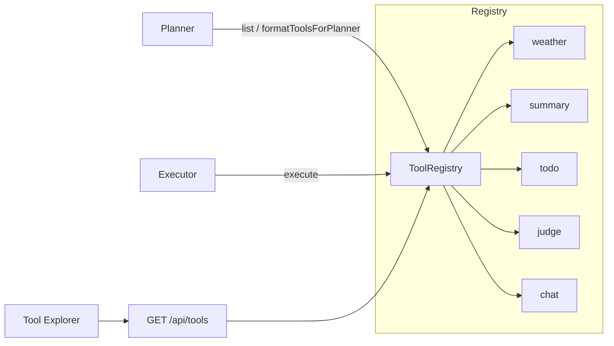

# 第22天学习总结：Tool Registry + Dynamic Tool System

对照 `ollama-chat-day21/day21_learning_summary.md` §9 学习计划，本仓库 **`ollama-chat-day22`** 在 day21 **MySQL + Envelope + Upsert** 之上完成 **Plugin-based Agent Runtime V1**：

```text
Tool Registry
├── weather
├── summary
├── todo
├── judge
└── chat

Runtime：  workflowToolRegistry.execute(action, toolInput)
Planner：  formatToolsForPlanner(registry) 动态生成可用工具列表
UI：       侧栏 Tool Explorer（GET /api/tools）
```

---

## 1. 为什么从 if/else 升级到 Registry？

| 之前 | 问题 |
|------|------|
| `if (step.action === "weather") { ... }` | 工具增多后 Executor 臃肿 |
| Planner Prompt 写死 action 列表 | 新工具需改两处代码 |
| 无统一入参校验 | Planner 输出 `{}` 时运行时才暴露 |

**核心认知**：`Tool = Runtime Plugin`；Runtime 只依赖 **Tool 接口**，不「认识」具体函数。

---

## 2. 能力对比

| 阶段 | 工具分发 |
|------|----------|
| 第21天 | Executor 内 `if/else` + Planner 写死 action |
| **第22天** | `ToolRegistry.register` + `execute`；Planner 读 `registry.list()` |

```text
第21天  Persistent DAG + HITL + MySQL + Envelope + Upsert
第22天  … + Tool Registry + Schema + Validator + Tool Explorer
```

（Upsert 保留 `created_at`、backend 保存仅 POST 一次等能力仍保留，见 §7。）

---

## 3. 实现清单

| 任务 | 文件 | 状态 |
|------|------|------|
| 定义 `Tool` 接口（含 Schema） | `lib/tool-registry.ts` | ✅ |
| 实现 `ToolRegistry`（register / get / list / execute） | `lib/tool-registry.ts` | ✅ |
| 注册 weather / summary / todo / judge / chat | `lib/workflow-tools.ts` | ✅ |
| Executor 改为 Registry 驱动 | `lib/workflow-executor.ts` | ✅ |
| Planner 动态工具 Prompt | `lib/workflow-planner.ts` | ✅ |
| `validateToolInput` 执行前校验 | `lib/tool-registry.ts` | ✅ |
| `GET /api/tools` | `app/api/tools/route.ts` | ✅ |
| 前端 Tool Explorer | `app/page.tsx` | ✅ |
| `[ToolRegistry] register` / `execute` 日志 | `lib/tool-registry.ts` | ✅ |
| 打破循环依赖（chat 执行） | `lib/workflow-chat.ts` | ✅ |

---

## 4. 核心代码说明

### 4.1 Tool 接口

```ts
type Tool = {
  name: string
  description: string
  inputSchema?: ToolSchema
  outputSchema?: ToolSchema
  execute(input: WorkflowToolExecuteInput): Promise<unknown>
}
```

`WorkflowToolExecuteInput` 由 `buildWorkflowToolInput` 从 `WorkflowStep` + 依赖链上下文组装，供所有工具共用。

### 4.2 ToolRegistry

```ts
workflowToolRegistry.register(weatherTool)
await workflowToolRegistry.execute(step.action, toolInput)
```

注册时打印 `[ToolRegistry] register <name>`；执行时打印 `[ToolRegistry] execute { tool, stepId }`。

### 4.3 Executor 变化

**之前**：`if (step.action === "summary")` 等多分支。  
**之后**：单入口 `workflowToolRegistry.execute(step.action, toolInput)`。

校验失败抛出 `ToolValidationError`（如 weather 缺少可解析的 `city`），步骤进入重试/失败流程。

### 4.4 Planner 动态工具列表

```ts
const toolPrompt = formatToolsForPlanner(workflowToolRegistry)
// Planner Prompt 片段：
// 可用工具（action 必须与工具 name 一致）：
// - weather: 查询天气…
// - summary: …
```

新增工具只需 `registry.register(newTool)`，Planner **自动**感知（无需改 Prompt 字符串）。

### 4.5 Tool Validator

`validateToolInput(tool, input)` 在 `execute` 内调用：

- 按 `inputSchema` 检查必填字段；
- `weather`：`extractWeatherCity(step.input || 最新 user 消息)` 为空则报「缺少 city」。

### 4.6 Tool Explorer

- API：`GET /api/tools` → `{ ok, data: ToolDescriptor[] }`
- UI：右侧栏 **Tool Explorer** 展示 `name`、`description`、`inputSchema`、`outputSchema`

---

## 5. 架构示意



---

## 6. 第22天打卡（Tool Registry）

```text
【第22天打卡】

1. 是否定义 Tool 接口：是
2. 是否实现 ToolRegistry：是
3. 是否支持 register / get / execute：是
4. Executor 是否改成 Registry 驱动：是
5. Planner 是否动态读取工具列表：是
6. 是否增加 Tool Schema：是
7. 是否实现 Tool Validator：是
8. 前端是否展示 Tool Explorer：是
9. 是否增加 ToolRegistry debug 日志：是

10. 遇到的最大问题：（自填）

11. 当前系统能力：
Plugin-based Agent Runtime V1 + Persistent DAG + HITL + MySQL + Envelope + Upsert
```

---

## 7. 延续能力（day21 §8 Upsert，未回退）

| 项 | 说明 |
|----|------|
| SQL upsert 保留 `created_at` | `lib/mysql-workflow-store.ts` |
| backend 保存仅 POST | `lib/workflow-persistence.ts` |
| POST 响应 `created` / `createdAt` | `app/api/workflows/route.ts` |

回归用例见 `day22_test_cases.md` §3。

---

## 8. 相关文件

| 文件 | 说明 |
|------|------|
| `lib/tool-registry.ts` | Tool / ToolRegistry / Validator / Planner 格式化 |
| `lib/workflow-tools.ts` | 五类工具注册 + `WORKFLOW_ALLOWED_ACTIONS` |
| `lib/workflow-chat.ts` | chat 工具实现（避免与 planner 循环依赖） |
| `lib/workflow-executor.ts` | Registry 驱动执行 |
| `lib/workflow-planner.ts` | 动态工具 Prompt |
| `app/api/tools/route.ts` | 工具列表 API |
| `app/page.tsx` | Tool Explorer UI |
| `day22_test_cases.md` | TC-22-01 ~ TC-22-12 |

---

*实现日期：2026-05-23（第22天 Tool Registry）；Upsert 见 §7；测试步骤见 `day22_test_cases.md`。*
