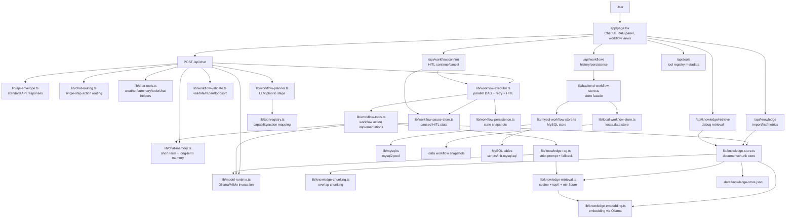
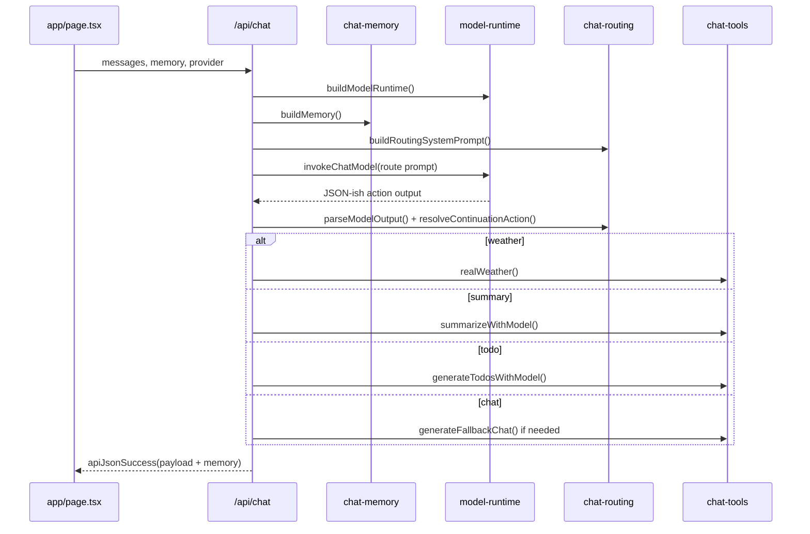
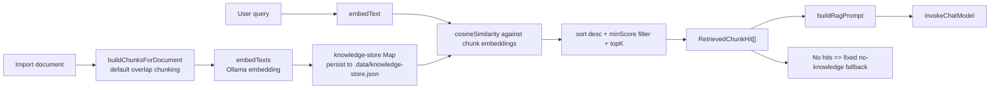
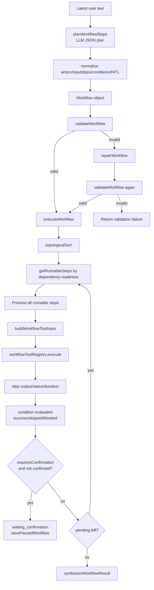
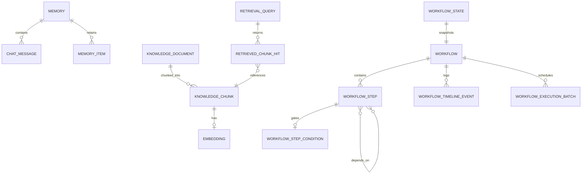

# ollama-chat-day25 Knowledge Graph

> Generated on 2026-05-30. The requested "Understand Anything" plugin is not available in the current installable plugin list, so this graph is generated from local source-code inspection.

## Project Identity

- **App**: `ollama-chat-day25`
- **Stack**: Next.js `16.2.4`, React `19.2.4`, TypeScript, Tailwind CSS 4, MySQL optional persistence
- **Runtime purpose**: Local/MiMo chat agent with memory, tool routing, RAG knowledge base, and multi-step workflow execution
- **Primary UI**: `app/page.tsx`
- **Primary API surface**: `app/api/**/route.ts`
- **Core domains**: Chat, Memory, Tool Routing, Knowledge/RAG, Workflow DAG, Persistence

## System Knowledge Graph

## Main Runtime Flows

### 1. Single-Turn Chat Flow

### 2. RAG Knowledge Flow

### 3. Workflow DAG Flow

## Module Map

| Area | Files | Responsibility |
| --- | --- | --- |
| UI | `app/page.tsx`, `app/globals.css`, `app/layout.tsx` | Chat surface, RAG debug panel, workflow cards/history controls |
| Chat API | `app/api/chat/route.ts` | Main orchestrator for memory, single-step routing, workflow execution |
| API envelope | `lib/api-envelope.ts`, `lib/api-client.ts` | Consistent success/error response shapes and client fetch helper |
| Model runtime | `lib/model-runtime.ts`, `lib/mimo-models.ts` | Provider selection and LLM calls for Ollama/MiMo |
| Memory | `lib/chat-memory.ts`, `lib/chat-types.ts` | Short-term messages, long-term memory extraction/formatting |
| Single-step tools | `lib/chat-routing.ts`, `lib/chat-tools.ts` | Route user intent to chat/weather/summary/todo |
| Tool registry | `lib/tool-registry.ts`, `lib/workflow-tools.ts` | Workflow tool definitions, capability routing, input validation |
| Knowledge/RAG | `lib/knowledge-*` | Document import, chunking, embedding, retrieval, strict RAG answer |
| Workflow | `lib/workflow-*` | Planning, validation, DAG execution, HITL pause, logs, persistence |
| Persistence | `lib/backend-workflow-store.ts`, `lib/local-workflow-store.ts`, `lib/mysql-workflow-store.ts`, `lib/mysql.ts` | Store abstraction with local and MySQL backends |
| Scripts | `scripts/*.mjs`, `scripts/init-mysql.sql` | Test runners and MySQL schema initialization |

## Entity Relationships

## Important Data Types

- `Memory`: `{ shortTerm, items }`, shared by chat and workflows.
- `ChatResponseBody`: typed response union carrying `memory`.
- `KnowledgeDocument`: imported document with generated chunks and embeddings.
- `KnowledgeChunk`: text slice plus document offsets, index, token estimate, optional embedding.
- `RetrieveOptions`: `{ topK, minScore }`.
- `RetrievedChunkHit`: scored retrieval result with chunk/document metadata.
- `RagAnswerResult`: answer, hits, and fallback marker.
- `Workflow`: goal, status, steps, timeline, execution batches.
- `WorkflowStep`: action, input, deps, condition, confirmation, status, output/error/duration.
- `WorkflowState`: persisted workflow snapshot for resume/history.

## External Dependencies And Side Effects

- **Ollama local model runtime**: Used for chat and embeddings. RAG embedding expects an embedding model such as `nomic-embed-text`.
- **MiMo provider**: Optional chat runtime path controlled by env/config.
- **Open-Meteo**: Weather tool path in `chat-tools`.
- **Filesystem**: `.data/knowledge-store.json`, workflow snapshots, workflow logs.
- **MySQL**: Optional backend persistence via `mysql2` and `scripts/init-mysql.sql`.

## Reading Guide

1. Start with `app/api/chat/route.ts` to understand the orchestration boundary.
2. Read `lib/model-runtime.ts` to understand model provider behavior.
3. Read `lib/chat-memory.ts`, `lib/chat-routing.ts`, and `lib/chat-tools.ts` for single-turn agent behavior.
4. Read `lib/knowledge-store.ts`, `lib/knowledge-retrieval.ts`, and `lib/knowledge-rag.ts` for RAG behavior.
5. Read `lib/workflow-planner.ts`, `lib/workflow-validate.ts`, `lib/workflow-executor.ts`, and `lib/workflow-tools.ts` for workflow behavior.
6. Read `lib/backend-workflow-store.ts` and the local/MySQL store files for persistence behavior.

