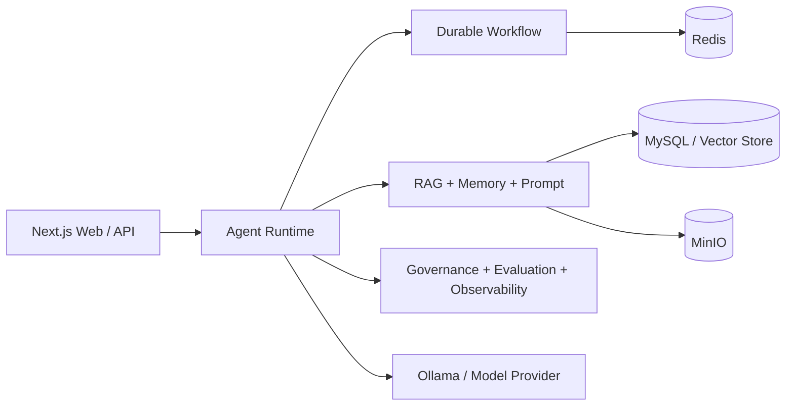

# Ollama Chat Day 75 · Agent Platform v1.0.0

Day 75 主题：Agent Platform Portfolio & Engineering Maturity（智能体平台作品集与工程成熟度）。这是 75 天学习路线的最终综合项目：在完整继承 Day74 业务代码的基础上，将平台整理为可展示、可面试、可开源、可复现和可持续维护的正式作品集。

## 目标用户

- 希望学习生产级 Agent（智能体）平台架构的开发者。
- 需要构建本地大模型、RAG、工作流和治理能力的团队。
- 希望评估架构取舍、工程成熟度与部署方式的面试官或维护者。

## 核心能力

| 能力 | 工程实现 |
| --- | --- |
| Agent Runtime | Planner、Tool Calling、Memory、Reflection 与 Trace |
| Multi-Agent | Supervisor 规划、角色协作、结果合并与冲突处理 |
| DAG Workflow | 依赖校验、并发节点、失败处理与人工确认 |
| Durable Execution | Checkpoint、Replay、Resume 与持久化状态机 |
| Production RAG | Query Rewrite、Hybrid Search、Rerank、Citation 与 Index Version |
| Long-Term Memory | Session / Long-Term 分层、抽取、压缩、检索与治理 |
| Prompt Management | 模板、版本、实验、质量门禁与发布 |
| Evaluation | 数据集、批量评估、回归对比、坏案例与 Quality Gate |
| Observability | Structured Log、Metric、Trace、Alert 与 Error Tracking |
| Multi-Tenant Security | Tenant、RBAC、Permission、Quota、Audit 与 API Gateway |
| Production Delivery | Docker Compose、Migration、Health、Backup、CI 与 Feature Flag |

## Overall Architecture



五张详细架构图、模块边界与关键链路见 [docs/architecture.md](docs/architecture.md)，关键取舍见 [docs/adr/README.md](docs/adr/README.md)。

## Quick Start

仅启动本地页面（不要求 MySQL、Redis、MinIO 或 Ollama）：

```powershell
npm install
npm run dev
```

访问入口：

- Day75 主工作台：`http://localhost:3000`
- Day75 Portfolio：`http://localhost:3000/portfolio`
- Production Dashboard：`http://localhost:3000/production`
- Governance Dashboard：`http://localhost:3000/governance`

完整 Docker 教学环境：

```powershell
Copy-Item .env.example .env
# 修改示例密钥后执行
docker compose up -d --build
```

详细步骤见 [docs/deployment.md](docs/deployment.md)。真实容器未启动时，`/api/health` 返回 `503` 属于预期行为。

## 配置与安全

`.env.example` 只包含教学示例。生产环境必须使用 Secret Manager 注入随机密钥，禁止提交 `.env`。发布检查与已知风险见 [docs/security-checklist.md](docs/security-checklist.md)。

## 测试

```powershell
npm run typecheck
npm run test:day75
npm run test:all
npm run lint
npm run build
```

自动与人工用例见 [day75_test_cases.md](day75_test_cases.md)，基准方法和结果见 [benchmark/README.md](benchmark/README.md)。

## Demo 与作品集入口

- [Demo Story](docs/demo-story.md)：研究智能体端到端业务故事。
- [Interview Q&A](docs/interview-qa.md)：30 组架构与工程问答。
- [Highlights](docs/highlights.md)：README、简历和面试可复用亮点。
- [Portfolio Package](docs/portfolio-package.md)：最终发布包清单。
- [CHANGELOG](CHANGELOG.md)：v1.0.0 正式版本说明。

## 常见问题

**必须安装 Ollama 吗？** 阅读代码、查看页面和执行静态验收不需要；真实模型对话才需要。

**为什么本地健康检查可能失败？** `/api/health` 会探测 MySQL、Redis 和 MinIO；只运行 `npm run dev` 时依赖未启动是正常状态。

**项目是否声称完成真实生产验证？** 不会。代码层验证与本机 Docker 演练明确分开；未执行的真实压测、恢复与依赖审计在安全和基准文档中标记为待环境验证。

## Release

当前正式版本：`v1.0.0`。版本包含源代码、架构文档、演示流程、基准测试、面试材料与安全检查记录。
