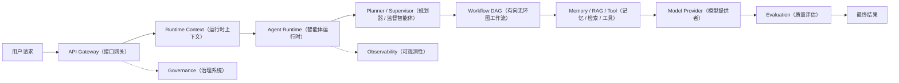
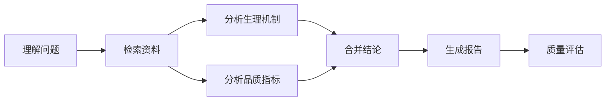
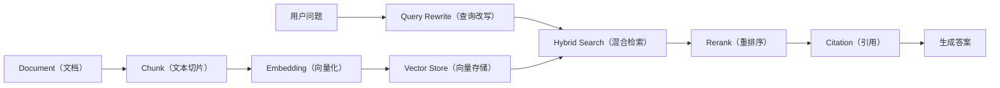
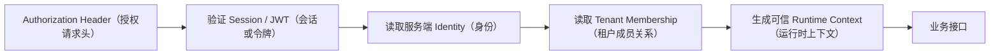
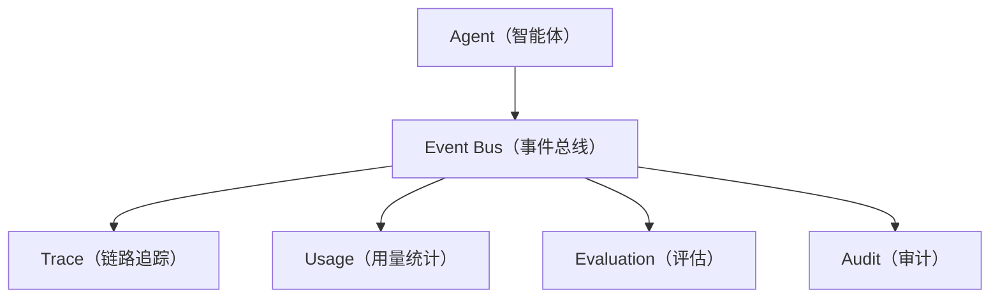

# Day75 学习总结：Agent Platform Portfolio & Engineering Maturity（智能体平台作品集与工程成熟度）

## 一、文档说明

本文档整理第 75 天项目完成后的学习型对话，包括：

- 如何从整体上读懂 `ollama-chat-day75` 项目。
- 项目使用了哪些前端、智能体、工作流、RAG（检索增强生成）、记忆、评估、治理与生产工程知识。
- Day75 相比 Day74 改进了什么，以及为什么采用这些改进。
- 当前项目的优点、工程边界和后续改进优先级。
- 已完成状态下的第 75 天打卡记录。

按照要求，本文档不记录创建目录、复制代码、修改文件、运行命令、提交代码和推送远程仓库等项目操作型对话，只保留能够帮助理解架构、设计取舍和工程改进的学习内容。

---

## 二、对话一：读懂 Day75 项目

### 用户提问

> 带我来读懂 `ollama-chat-day75` 这个文件夹中的项目做了什么，运用了什么知识，对比 `ollama-chat-day74` 有什么改进，为什么这样子做？英文专业术语后面补充一个括号，说明其中文名称或者中文描述。

### 回答

`ollama-chat-day75` 可以用一句话概括：

> 这是一个以 Next.js（React 全栈框架）为应用外壳、以 Agent Platform（智能体平台）为核心的综合工程项目。它把 Agent（智能体）、Workflow（工作流）、RAG（检索增强生成）、Memory（记忆系统）、Evaluation（评估系统）、Observability（可观测性）、Governance（治理系统）和 Production Delivery（生产交付）连接成完整闭环，并在 Day75 将其整理成可展示、可讲解、可测试和可维护的 v1.0.0 工程作品集。

它不只是一个调用 Ollama（本地大模型运行工具）的聊天页面。一个完整请求可能经过以下链路：



一次请求进入系统后，系统可能依次完成：

1. 检查用户身份、租户和权限。
2. 创建统一 Runtime Context（运行时上下文）。
3. 判断请求属于简单聊天还是复杂任务。
4. 由 Supervisor Agent（监督智能体）拆解复杂目标。
5. 按 Workflow DAG（有向无环图工作流）的依赖关系执行步骤。
6. 检索 Knowledge Base（知识库）和 Long-Term Memory（长期记忆）。
7. 调用 Model（模型）或 Tool（工具）。
8. 对输出进行 Reflection（反思）与 Evaluation（评估）。
9. 记录 Log（日志）、Metric（指标）、Trace（链路）、Token（词元）和 Cost（成本）。
10. 返回最终答案。

### 1. 项目目录如何理解

| 目录 | 作用 |
| --- | --- |
| `app/` | Next.js 页面和 Route Handler（路由处理器） |
| `lib/agents/` | Agent Runtime（智能体运行时）、注册、执行和追踪 |
| `lib/workflow/` | DAG Workflow（有向无环图工作流）、持久化执行和恢复 |
| `lib/knowledge/` | Knowledge Base（知识库）和 RAG（检索增强生成） |
| `lib/memory/` | Session Memory（会话记忆）和 Long-Term Memory（长期记忆） |
| `lib/prompts/` | Prompt Management（提示词管理）、版本和实验 |
| `lib/model/` | Model Registry（模型注册）、路由、降级和协作 |
| `lib/evaluation/` | Evaluation（评估）、回归测试和质量门禁 |
| `lib/observability/` | Log（日志）、Metric（指标）、Trace（链路）和 Alert（告警） |
| `lib/governance/` | Tenant（租户）、RBAC（基于角色的访问控制）、配额和审计 |
| `lib/production/` | 生产配置、健康检查、版本、备份和功能开关 |
| `lib/queue/` | Redis Queue（Redis 任务队列）和 Worker（任务执行器） |
| `lib/storage/` | Local Storage（本地存储）和 MinIO Object Storage（对象存储） |
| `scripts/` | 自动测试、迁移、备份、压测和故障测试 |
| `migrations/` | MySQL Migration（数据库迁移）及回滚脚本 |
| `docs/` | 架构、ADR（架构决策记录）、演示、面试和安全文档 |
| `benchmark/` | Benchmark（基准测试）协议和结构化结果 |
| `tests/` | 测试范围和测试入口说明 |

### 2. 页面与接口层

`app/page.tsx` 是主工作台，负责聊天消息、输入状态、工作流开关、接口调用以及多个能力面板的组合。它主要承担 UI State（界面状态）和交互编排，不应该被误认为所有智能体算法都在这个页面中完成。

`app/api/chat/route.ts` 是 Chat Route Handler（聊天路由处理器），相当于传统后端中的 Controller（控制器）。它负责解析输入、选择执行路径、调用运行时并返回统一 API Response（接口响应）。这种分层体现了接口层与领域逻辑分离的思想。

### 3. Runtime Context（运行时上下文）

Runtime Context（运行时上下文）是一张随着请求在平台内部传递的身份与执行信息卡，通常包含：

- `requestId`：请求编号。
- `traceId`：链路追踪编号。
- `sessionId`：会话编号。
- `tenantId`：租户编号。
- `userId`：用户编号。
- `permissions`：权限信息。
- `budget`：模型与工具调用预算。
- `metadata`：可安全展示的扩展信息。

统一上下文解决 Cross-Cutting Concerns（横切关注点）问题。身份、权限、追踪和预算会横跨 Agent（智能体）、Workflow（工作流）、RAG（检索增强生成）、Memory（记忆）与 Tool（工具），如果每一层分别读取或拼装这些信息，就容易遗漏租户过滤、丢失 Trace ID（链路编号）或无法统一统计成本。

### 4. Agent Runtime（智能体运行时）

Agent Runtime（智能体运行时）是平台的执行中枢，主要包含：

- Agent Registry（智能体注册中心）：保存 Supervisor、Research、Writer 和 Critic 等不同角色。
- Planner（规划器）：把用户目标拆解为可执行任务。
- Supervisor Agent（监督智能体）：分派任务、监督执行并合并结果。
- Tool Calling（工具调用）：让智能体调用检索、总结、计划和知识索引等能力。
- Reflection（反思）：在输出后检查完整性、证据、格式和错误，并在受控次数内改进。
- Trace（链路追踪）：记录 Agent Span（智能体跨度）、Tool Span（工具跨度）、Memory Span（记忆跨度）、Workflow Span（工作流跨度）和 Evaluation Span（评估跨度）。

Reflection（反思）能够提高结果质量，但会增加 Token（词元）、Latency（延迟）和 Cost（成本），因此需要限制重试次数，而不能无限循环。

### 5. Workflow DAG（有向无环图工作流）

DAG 是 Directed Acyclic Graph（有向无环图），用于表达复杂任务的依赖关系：



DAG 的价值包括：

- 能在运行前检测循环依赖。
- 能明确步骤之间的前后关系。
- 没有依赖冲突的步骤可以并行执行。
- 可以在节点边界保存 Checkpoint（检查点）。
- 故障后可以只恢复未完成节点。

Durable Execution（持久化执行）表示工作流状态不应只存在于函数调用栈中，而需要保存 Workflow Definition（工作流定义）、Workflow Run（工作流运行实例）、Node Status（节点状态）、Checkpoint（检查点）和 Domain Event（领域事件）。这样程序中断后可以 Resume（恢复）或 Replay（回放），避免昂贵的模型调用全部重做。

### 6. RAG（检索增强生成）

RAG 的核心流水线是：



项目运用了以下知识：

- Chunking（文本切片）：通过 Sliding Window（滑动窗口）和重叠区域避免上下文被生硬切断。
- Embedding（向量化）：把文本转换成数值向量，以计算语义相似度。
- Deterministic Embedding Provider（确定性向量提供者）：测试中生成稳定向量，使离线自动测试可以复现。
- Hybrid Search（混合检索）：结合 Keyword Search（关键词检索）与 Vector Search（向量检索）。
- Rerank（重排序）：初次召回追求 Recall（召回率），重排序进一步提高最终相关性。
- Citation（引用）：保存知识库、文档、片段、索引版本和对象位置，使答案可以追溯。

### 7. Memory（记忆系统）

项目把记忆分成：

- Session Memory（会话记忆）：保存当前对话的短期上下文。
- Long-Term Memory（长期记忆）：保存跨会话有价值的偏好、经验和历史事实。

长期记忆不是把全部聊天永久保存，而是经过 Experience Extraction（经验抽取）、Importance Scoring（重要性评分）、Compression（压缩）、Deduplication（去重）、Expiration（过期）和 Governance（治理）。错误、过期或敏感记忆如果没有治理，反而会污染后续回答。

### 8. Prompt 与 Model 平台

Prompt Management（提示词管理）包括：

- Prompt Template（提示词模板）。
- Prompt Version（提示词版本）。
- Prompt Block（提示词块）。
- Prompt Experiment（提示词实验）。
- A/B Test（A/B 对比实验）。
- Promotion（晋级发布）。
- Rollback（回滚）。
- Quality Gate（质量门禁）。

Model Router（模型路由器）可以根据任务能力、Latency（延迟）、Cost（成本）、Health（健康状态）和 Budget（预算）选择模型。Circuit Breaker（熔断器）会在模型连续失败时暂时停止向其发送请求，防止故障扩散。

### 9. Evaluation（评估系统）

AI 输出具有不确定性，因此不能只依赖“看起来不错”。项目使用：

- Evaluation Dataset（评估数据集）。
- Batch Evaluation（批量评估）。
- Baseline（基准版本）。
- Regression Comparison（回归比较）。
- Bad Case（坏案例）。
- Quality Gate（质量门禁）。

如果候选 Prompt（提示词）的平均分提高，但 Citation Accuracy（引用准确率）下降，仍然可能不能发布。质量门禁需要同时检查质量、回归、安全和业务约束。

### 10. Observability（可观测性）与 Governance（治理）

Observability（可观测性）包含 Structured Log（结构化日志）、Metric（指标）、Trace（链路）、Error Tracking（错误追踪）、Alert（告警）和 Sampling（采样），用于回答请求为何变慢、模型为何失败、哪个工具最耗时以及某个 Prompt 版本是否引发质量下降。

Governance（治理）包含 Tenant（租户）、Identity（身份）、RBAC（基于角色的访问控制）、Permission（权限）、Quota（配额）、Audit Log（审计日志）和 API Gateway（接口网关）。Tenant Isolation（租户隔离）不能只靠前端隐藏按钮，而需要身份、运行时上下文、数据查询、Redis Key（Redis 键）和对象存储共同执行隔离。

### 11. Production Delivery（生产交付）

Day75 继承了 Day74 的以下生产工程能力：

- Dockerization（容器化）。
- Docker Compose（多容器编排）。
- MySQL Migration（数据库迁移）。
- Health Check（健康检查）。
- Startup Validation（启动校验）。
- CI Pipeline（持续集成流水线）。
- Backup / Restore（备份与恢复）。
- Feature Flag（功能开关）。
- Load Test（压力测试）。
- Failure Recovery Test（故障恢复测试）。

完整环境由 Next.js 应用、MySQL、Redis、MinIO 和 Ollama 组成。MySQL 保存结构化数据，Redis 承担缓存、队列和锁，MinIO 保存知识文档和对象，Ollama 运行本地大模型。

### 12. Day75 相比 Day74 的改进

Day75 的重点不是继续增加更多底层 Agent 功能，而是把 Day74 的生产发布候选项目整理为正式工程作品集。

| 对比项 | Day74 | Day75 |
| --- | --- | --- |
| 主题 | Production Delivery & Release（生产交付与发布） | Portfolio & Engineering Maturity（作品集与工程成熟度） |
| 版本 | `1.0.0-rc.1` 候选版本 | `1.0.0` 正式作品集版本 |
| 核心工作 | Docker、迁移、健康、备份、CI 和功能开关 | 架构解释、ADR、演示、基准、面试和安全记录 |
| 页面 | Production Dashboard（生产仪表盘） | 新增 Portfolio Dashboard（作品集总览） |
| 架构文档 | 基础说明 | 五张完整 Mermaid（文本化架构图） |
| ADR | 未系统整理 | 十份 Architecture Decision Record（架构决策记录） |
| Demo | 基础演示说明 | 完整 Research Agent（研究智能体）业务故事 |
| Benchmark | 压测脚本为主 | 补充环境、规模、参数、次数和证据边界 |
| 面试材料 | 没有完整体系 | 三十组结合项目实现的问答 |
| 安全 | 安全能力和部署说明 | 最终发布检查与依赖审计记录 |
| 验收 | Day74 生产能力测试 | 新增 Day75 作品集结构自动验收 |

为什么这样做？因为真实项目不仅要“代码能运行”，还需要：

1. 新成员能够快速理解。
2. 使用者能够快速启动。
3. 架构选择可以被解释。
4. 测试结果能够复现。
5. 项目价值能够通过业务故事演示。
6. 风险、限制和未完成验证不会被隐藏。
7. 面试时能够说明方案、备选方案和工程权衡。
8. 后续维护者知道系统应怎样扩展。

这就是 Engineering Maturity（工程成熟度）。

### 13. 推荐阅读顺序

1. `README.md`：理解目标、能力和启动方式。
2. `app/portfolio/page.tsx`：查看 Day75 交付物。
3. `docs/architecture.md`：理解五张核心架构图。
4. `docs/demo-story.md`：通过业务故事理解模块协作。
5. `app/api/chat/route.ts`：从聊天请求入口追踪执行链路。
6. `lib/runtime/unified-runtime-context.ts`：理解身份、租户和追踪信息。
7. `lib/agents/agent-runtime.ts`：理解 Agent、Tool、Reflection 和 Trace。
8. `lib/workflow/durable-workflow-platform.ts`：理解 DAG、检查点和恢复。
9. `lib/knowledge/production-knowledge-platform.ts`：理解 RAG、索引和引用。
10. `docs/adr/README.md`：理解为什么采用当前架构。

这部分对话最重要的结论是：

> Day74 证明平台具备生产交付所需的代码和配置；Day75 进一步让平台的设计可以被解释、能力可以被验证、价值可以被演示、风险可以被说明、项目可以被长期维护。

---

## 三、对话二：项目评价与后续改进

### 用户提问

> 你觉得 `ollama-chat-day75` 文件夹内的项目怎么样，还有什么要改进或者新增的地方吗？

### 回答

总体评价：这是一个优秀的学习项目和架构作品集，但距离可以直接对外服务的 Production Platform（生产级平台）仍有一些关键工程差距。

- 作为 Portfolio Project（作品集项目）：约 8 / 10。
- 作为可真实对外服务的生产系统：约 5 / 10。

它最不缺的是功能数量，最需要的是将现有能力从“设计完整、演示可用”推进到“真实持久化、真实安全、真实环境验证”。

### 1. 项目的主要优点

#### 架构覆盖完整

项目已经覆盖 Agent Runtime（智能体运行时）、Multi-Agent Collaboration（多智能体协作）、DAG Workflow（有向无环图工作流）、Durable Execution（持久化执行）、RAG（检索增强生成）、Memory（记忆）、Prompt Management（提示词管理）、Evaluation（评估）、Observability（可观测性）、Governance（治理）和 Production Delivery（生产交付）。

特别是 Runtime Context（运行时上下文）、Checkpoint（检查点）、Citation（引用）、Quality Gate（质量门禁）和 Tenant Isolation（租户隔离），说明项目已经开始考虑恢复、追踪、解释、测试、权限和维护，而不只是模型能否返回文字。

#### 架构取舍解释清楚

ADR（架构决策记录）不仅记录“使用了什么”，还解释问题、决策、备选方案、收益、成本和后续影响。这比只展示最终代码更接近高级工程师的工作方式。

#### 模拟与真实结果边界明确

Benchmark（基准测试）使用 `verified` 和 `planned` 区分已经验证与等待完整环境采集的结果。代码中的 Simulated Output（模拟输出）、Deterministic Embedding（确定性向量）和 In-Memory Provider（内存提供者）也有明确说明，没有把模拟数据冒充生产成绩。

#### 学习演进过程完整

Day64 到 Day75 的回归脚本保留了统一上下文、事件、注册中心、提示词、记忆、知识库、工作流、评估、可观测性、治理和生产交付的演进过程，适合复习和面试讲解。

### 2. P0：最高优先级改进

#### 修复 GitHub Actions（GitHub 自动化流水线）位置

当前 CI（持续集成）文件放在 `ollama-chat-day75/.github/workflows/`。GitHub 只会自动识别仓库根目录的 `.github/workflows/*.yml`，因此嵌套的工作流不会自动触发。

正确做法是把工作流放到仓库根目录，并配置：

```yaml
defaults:
  run:
    working-directory: ollama-chat-day75
```

Docker Build（容器镜像构建）也要把 `ollama-chat-day75` 设置为构建上下文，并把 Day74 名称更新为 Day75。

#### 不允许接口信任客户端身份字段

部分业务接口会从请求正文读取 `userId`、`tenantId`、`isAdmin`、`createdBy` 或 `scopeId`。教学演示中这样比较方便，但生产环境不能相信客户端自行声明管理员身份。

正确链路应为：



`userId`、`tenantId`、`createdBy` 和 `isAdmin` 都应该来自服务端认证结果，而不是普通 JSON（结构化请求数据）。

#### 将关键 Map（内存映射）替换为真实持久化

当前很多平台状态仍保存在进程内 `Map` 中，包括 Workflow Definition（工作流定义）、Checkpoint（检查点）、Evaluation Run（评估运行）、Feature Flag（功能开关）、Tenant Identity（租户身份）、Quota Usage（配额用量）、Trace（链路）和 Knowledge Metadata（知识元数据）。

这会导致：

- Node.js 进程重启后状态可能丢失。
- 多实例部署时每个实例看到的数据不同。
- Durable Execution（持久化执行）无法真正跨进程恢复。
- Feature Flag（功能开关）和 Quota（配额）可能在实例之间不一致。

推荐持久化方案：

| 当前能力 | 推荐方案 |
| --- | --- |
| Workflow / Checkpoint | MySQL |
| Feature Flag | MySQL 或 Redis |
| Quota / Rate Limit（配额 / 限流） | Redis |
| Tenant / User / Role | MySQL |
| Evaluation Run / Baseline | MySQL |
| Knowledge Metadata | MySQL |
| Vector（向量） | Qdrant、Milvus、pgvector 或其他 Vector Store（向量数据库） |
| Trace / Metric | OpenTelemetry（开放遥测标准）与 Jaeger / Prometheus |
| Object（对象） | MinIO |

Memory Provider（内存提供者）可以保留给测试，但生产启动时需要显式选择持久化 Provider（提供者）。

### 3. P1：重要工程改进

#### 引入标准测试体系

当前主要使用 `tsx scripts/test-day*.ts` 自定义脚本，适合学习，但缺少 Test Runner（测试运行器）、Coverage（覆盖率）、Browser E2E Test（浏览器端到端测试）和真实基础设施 Integration Test（集成测试）。

推荐加入：

- Vitest（TypeScript 单元测试框架）。
- Playwright（浏览器端到端测试框架）。
- Testcontainers（测试容器框架）。
- Coverage Threshold（覆盖率阈值）。

测试目录可以整理为：

```text
tests/
├── unit/              # 单元测试
├── integration/       # MySQL、Redis、MinIO 和 API 集成测试
├── e2e/               # 浏览器完整操作测试
├── fixtures/          # 固定测试数据
└── security/          # 租户越权与攻击输入测试
```

最值得增加的用例包括：

1. Tenant A（租户 A）不能读取 Tenant B（租户 B）的知识库。
2. 客户端传入 `isAdmin: true` 不能提升权限。
3. Workflow（工作流）在进程重启后可以恢复。
4. 同一个 Idempotency Key（幂等键）不会执行两次外部副作用。
5. Redis 中断后任务不会永久丢失。
6. Migration（迁移）可以在空数据库和旧数据库上重复执行。
7. Backup（备份）后可以真正 Restore（恢复）。
8. Portfolio、聊天和生产页面通过浏览器测试。

#### 真正执行 Benchmark（基准测试）

当前 Agent、Workflow、RAG、Model 和 System 指标仍以测试协议为主。下一步应固定代码、模型、数据、参数和硬件，执行至少三轮并保存原始结果。

建议先完成一个可信的小型基准：

- 50 个 Agent 任务。
- 50 个 RAG 问题。
- 20 个故障恢复工作流。
- 固定 Ollama 模型和量化版本。
- 分开记录 Cold Cache（冷缓存）与 Warm Cache（热缓存）。
- 输出 JSON 原始结果和 Markdown 汇总。

需要测量 Success Rate（成功率）、Recall@K（前 K 项召回率）、Citation Accuracy（引用准确率）、Workflow Recovery Rate（工作流恢复率）、P95 Latency（第 95 百分位延迟）、Throughput（吞吐量）、Error Rate（错误率）、Token 和 Cost。

#### 完善 CI/CD（持续集成与持续交付）

在修复 CI 位置后，可以增加：

- Dependency Audit（依赖审计）。
- Secret Scan（密钥扫描）。
- CodeQL（代码安全分析）。
- Docker Image Scan（容器镜像扫描）。
- SBOM（软件物料清单）。
- Container Smoke Test（容器冒烟测试）。
- Migration Test（数据库迁移测试）。
- Release Artifact（发布产物）。
- Git Tag 与 GitHub Release（GitHub 正式发布页）。

#### 对齐依赖版本

`next` 和 `eslint-config-next` 已使用 `16.2.12`，但 `@next/env` 仍是 `16.2.4`。同一 Next.js 生态的依赖应尽量对齐到相同补丁版本，降低内部兼容风险。

#### 加强安全配置

当前 Next.js 配置已经隐藏 `X-Powered-By`、开启压缩、配置 Deployment ID（部署编号）和 Standalone Build（独立构建），还可以增加：

- Content-Security-Policy（内容安全策略）。
- Strict-Transport-Security（强制 HTTPS 策略）。
- X-Content-Type-Options（禁止内容类型猜测）。
- Referrer-Policy（来源信息策略）。
- Permissions-Policy（浏览器权限策略）。
- Request Body Size Limit（请求体大小限制）。
- CSRF Protection（跨站请求伪造保护）。
- Origin Check（请求来源检查）。
- Rate Limiting（请求限流）。
- Timeout 与 AbortSignal（超时与请求取消）。
- SSRF Protection（服务端请求伪造防护）。

### 4. P2：维护性改进

逐行中文注释对学习很有帮助，但生产维护时会产生机械注释过多、文件过大和重要说明被淹没的问题。`app/page.tsx`、`agent-runtime.ts` 和部分 Dashboard（仪表盘）组件已经比较大。

后续维护版本可以：

- 按 Feature（功能）拆分页面、Hooks（状态逻辑）和 API Client（接口客户端）。
- 把 Agent Runtime 拆成 Agent Invoker（智能体调用器）、Supervisor Runner（监督执行器）、Reflection Runner（反思执行器）和 Evaluation Runner（评估执行器）。
- 注释重点解释“为什么这样做”，不机械复述赋值语句。
- 为公共接口使用 TSDoc（TypeScript 文档注释）。
- 使用 Zod（TypeScript 结构校验库）统一验证 API Schema（接口数据结构）。
- 从 Schema（结构定义）自动生成 OpenAPI（开放接口规范）。

### 5. 最值得新增的三项能力

#### 真实认证系统

增加登录、退出、Session Cookie（会话 Cookie）、JWT（JSON 网络令牌）或服务端 Session（会话）、Password Hash（密码哈希）、Token Rotation（令牌轮换）以及服务端生成的 Tenant Context（租户上下文）。

#### Provider Architecture（提供者架构）

为模型、向量、存储和追踪建立可替换接口：

```text
ModelProvider（模型提供者）
├── OllamaProvider（Ollama 提供者）
├── OpenAICompatibleProvider（OpenAI 兼容提供者）
└── MockModelProvider（模拟模型提供者）

VectorProvider（向量提供者）
├── MemoryVectorProvider（内存向量提供者）
├── QdrantProvider（Qdrant 提供者）
└── PgVectorProvider（pgvector 提供者）

TraceProvider（追踪提供者）
├── MemoryTraceProvider（内存追踪提供者）
└── OpenTelemetryProvider（开放遥测提供者）
```

这样测试可以使用内存，开发环境使用本地服务，生产环境使用真实基础设施。

#### Golden Path Demo（黄金路径演示）

把 Demo Story（演示故事）实现为可以一键运行的端到端流程：

```powershell
npm run demo:seed
npm run demo:research
npm run demo:verify
```

它可以自动创建测试租户、导入固定知识、建立索引、启动研究工作流、模拟中断与恢复、生成带引用报告、执行质量评估、输出 Trace 和 Benchmark，并验证另一个租户无法读取结果。

### 6. 推荐改进顺序

第一阶段：修复 CI 位置、统一工作目录、禁止接口信任客户端身份、增加认证中间层、对齐依赖版本。

第二阶段：把 Workflow、Checkpoint、Tenant、User、Feature Flag、Quota、Knowledge Metadata 和 Evaluation Result 等关键状态持久化到 MySQL、Redis 和真实 Vector Store（向量存储）。

第三阶段：引入 Vitest、Playwright 与 Testcontainers，执行租户安全测试、真实 Benchmark、Backup / Restore 和故障恢复演练。

第四阶段：拆分超大文件、减少机械注释、统一接口校验并实现 Golden Path Demo（黄金路径演示）。

这部分对话最重要的结论是：

> 项目已经充分证明了对 Agent Platform（智能体平台）概念和架构的理解。下一步最有价值的工作，不是增加更多 Dashboard（仪表盘），而是证明这些设计在真实进程重启、真实租户攻击、真实数据库、真实模型、真实并发和真实 CI 环境中仍然成立。

---

## 四、完成 Day75 后的能力定位与进阶路线

### 补充总结

首先，恭喜完成 Day75。

这 75 天并不是简单学习了一遍 Agent Development（智能体开发），而是完整经历了：

```text
LLM Application Development（大语言模型应用开发）
  ↓
Agent Runtime（智能体运行时）
  ↓
Agent Platform（智能体平台）
  ↓
Production System（生产系统）
  ↓
Engineering Delivery（工程交付）
```

这条路线已经超过大多数只停留在调用 LangChain（大语言模型应用开发框架）或 Model API（模型接口）的 Agent 学习路径。

### 1. 当前真实阶段

如果把 Agent Engineer（智能体工程师）能力划分为不同层级，当前状态如下：

| 阶段 | 能力 | 当前状态 |
| --- | --- | --- |
| Level 0（第 0 级） | 调用 LLM API（大语言模型接口） | ✅ 已超过 |
| Level 1（第 1 级） | Chatbot / RAG Demo（聊天机器人 / 检索增强生成演示） | ✅ 已超过 |
| Level 2（第 2 级） | Tool Calling Agent（工具调用智能体） | ✅ 已超过 |
| Level 3（第 3 级） | Workflow Agent（工作流智能体） | ✅ 已超过 |
| Level 4（第 4 级） | Multi-Agent System（多智能体系统） | ✅ 已超过 |
| Level 5（第 5 级） | Agent Infrastructure Engineer（智能体基础设施工程师） | ✅ 已达到 |
| Level 6（第 6 级） | Production Agent Platform Engineer（生产级智能体平台工程师） | ✅ 接近达到 |
| Level 7（第 7 级） | Large-Scale Agent System Architect（大规模智能体系统架构师） | ⏳ 后续提升 |

因此，下一阶段的学习重点不应该继续“堆功能”，而应该从已有模块中深入研究内核、性能、可靠性、安全和大规模系统设计。

### 2. 后续路线需要改变

前 75 天的目标是从零构建 Agent Platform（智能体平台），这个目标已经完成。

后续进入 Phase 6：Agent Engineer Professionalization（第六阶段：智能体工程师职业化），目标是从“能够制造系统”升级为“能够设计、优化并负责生产智能体系统”。

建议后续分为四个阶段：

```text
Day 1-75
Agent Platform Construction（智能体平台建设）
        │
        ▼
Day 76-95
Deep Engineering（深度工程）
        │
        ▼
Day 96-120
AI System Optimization（人工智能系统优化）
        │
        ▼
Day 121-150
Senior Agent Engineer（高级智能体工程师）
```

### 3. 阶段一：Day76-Day90，Agent Runtime Deep Dive（智能体运行时深度研究）

这一阶段的目标，是把当前 Agent Runtime（智能体运行时）从教学级实现提升到接近真实框架的设计水平。

#### Day76：Agent Runtime Kernel Refactoring（智能体运行时内核重构）

学习真实 Agent Runtime（智能体运行时）的设计方式，重点研究：

- Execution Context（执行上下文）。
- Runtime Loop（运行时循环）。
- State Machine（状态机）。
- Event-Driven Execution（事件驱动执行）。

重新审视 Agent Runtime（智能体运行时）、Workflow Runtime（工作流运行时）和 Tool Runtime（工具运行时）之间的职责边界和调用关系。

#### Day77：Agent State Machine（智能体状态机）

Agent 不应该只有简单的 `input → LLM → output`（输入 → 大语言模型 → 输出），而应该具备清晰的状态生命周期：

```text
Created（已创建）
  ↓
Planning（规划中）
  ↓
Executing（执行中）
  ↓
Waiting Tool（等待工具）
  ↓
Reflecting（反思中）
  ↓
Evaluating（评估中）
  ↓
Completed（已完成）
```

目标是实现正式的 Agent State Machine（智能体状态机），使状态转换可以验证、追踪和恢复。

#### Day78：Agent Interrupt System（智能体中断系统）

研究生产 Agent 为什么需要：

- Pause（暂停）。
- Resume（恢复）。
- Interrupt（中断）。
- Human Approval（人工审批）。

在此基础上升级现有 HITL（人在回路，即执行过程中引入人工确认）能力。

#### Day79：Agent Memory Architecture Deep Dive（智能体记忆架构深度研究）

真实 Memory（记忆）不只是保存文本，需要进一步学习：

- Episodic Memory（情景记忆，保存发生过的具体事件和经历）。
- Semantic Memory（语义记忆，保存抽象事实和知识）。
- Procedural Memory（程序性记忆，保存技能、规则和操作流程）。

目标是升级现有 Memory System（记忆系统）的分类、抽取、检索、合并、遗忘和治理策略。

#### Day80：Context Engineering（上下文工程）

Context Engineering（上下文工程）是当前智能体系统的重要方向，研究如何管理和组合：

- System Prompt（系统提示词）。
- Memory（记忆）。
- RAG（检索增强生成）。
- History（历史对话）。
- Tools（工具说明和工具结果）。
- User Intent（用户意图）。

目标是构造质量更高、长度受控、证据明确并适合当前任务的最佳 Context（上下文）。

#### Day81-Day85：Agent Planning Advanced（高级智能体规划）

深入学习以下规划方法：

- Tree of Thought（思维树，通过搜索多条推理分支选择更优路径）。
- ReAct（推理与行动交替的智能体范式）。
- Reflection Planning（反思式规划）。
- Self-Correction（自我纠错）。
- Search Planning（搜索式规划）。

#### Day86-Day90：Agent Evaluation Advanced（高级智能体评估）

在 Day71 Evaluation Platform（评估平台）的基础上继续学习：

- LLM Judge（使用大语言模型作为评审器）。
- Pairwise Evaluation（成对比较评估）。
- Human Feedback（人类反馈）。
- Reward Model（奖励模型）。
- Preference Optimization（偏好优化）。

### 4. 阶段二：Day91-Day110，AI System Optimization（人工智能系统优化）

这一阶段是从普通工程师迈向高级工程师的关键，重点从“功能正确”转向性能、质量、成本和资源效率。

#### Day91-Day95：LLM Inference Optimization（大语言模型推理优化）

学习模型调用和推理优化：

- Streaming（流式输出）。
- Batch（批处理）。
- KV Cache（键值缓存，用于复用注意力计算）。
- Speculative Decoding（推测式解码，使用小模型预测并由大模型验证）。
- Quantization（量化，降低模型精度以减少内存和计算消耗）。

#### Day96-Day100：RAG Advanced（高级检索增强生成）

当前系统已经具备 Hybrid Search（混合检索）和 Rerank（重排序），下一步继续研究：

- Graph RAG（图结构检索增强生成）。
- Multi-Hop Retrieval（多跳检索，通过多个关联步骤寻找答案）。
- Query Planning（查询规划）。
- Retrieval Evaluation（检索评估）。
- Knowledge Graph（知识图谱）。

#### Day101-Day105：Model Routing Advanced（高级模型路由）

继续升级 Model Router（模型路由器），加入：

- Cost Optimization（成本优化）。
- Latency Optimization（延迟优化）。
- Quality Routing（按质量需求路由）。
- Dynamic Model Selection（动态模型选择）。

目标是根据任务难度、预算、延迟目标、模型健康度和历史质量动态选择模型，而不是只使用固定规则。

#### Day106-Day110：Agent Cost Engineering（智能体成本工程）

企业非常关注智能体系统成本，需要系统学习：

- Token Budget（词元预算）。
- Prompt Compression（提示词压缩）。
- Cache Strategy（缓存策略）。
- Model Selection（模型选择）。

目标是让每次 Agent 执行都能解释成本来源，并在不明显降低质量的前提下降低 Token、模型和基础设施消耗。

### 5. 阶段三：Day111-Day130，Large-Scale Agent System（大规模智能体系统）

这一阶段的目标，是学习真正的大规模系统架构。

#### Day111-Day115：Distributed Agent Architecture（分布式智能体架构）

研究多 Agent 集群的基本结构：

```text
Agent Cluster（智能体集群）
  ↓
Scheduler（调度器）
  ↓
Worker Pool（执行器池）
  ↓
State Store（状态存储）
```

重点学习任务分片、调度、公平性、幂等、租约、心跳、故障转移和水平扩展。

#### Day116-Day120：Event-Driven Agent Architecture（事件驱动智能体架构）

深入学习：

- Event Sourcing（事件溯源，以事件序列作为系统事实来源）。
- CQRS（命令查询职责分离）。
- Streaming Agent（流式智能体，持续接收和输出事件）。

#### Day121-Day125：Agent Security（智能体安全）

在 Day73 治理系统基础上深入研究：

- Prompt Injection Defense（提示词注入防御）。
- Data Leakage Prevention（数据泄漏防护）。
- Sandbox Tool Execution（沙箱化工具执行）。
- Model Security（模型安全）。

#### Day126-Day130：Agent Reliability Engineering（智能体可靠性工程）

按照 SRE（站点可靠性工程）方法研究：

- SLO（服务等级目标）。
- SLA（服务等级协议）。
- Error Budget（错误预算）。
- Chaos Testing（混沌测试，通过主动注入故障验证系统韧性）。

### 6. 阶段四：Day131-Day150，Senior Agent Engineer Project（高级智能体工程师项目）

最后完成一个真正的综合作品：Enterprise Research Agent Platform V2（企业研究智能体平台第二版）。

在当前平台基础上继续升级：

#### Multi-Tenant（多租户）企业化

现有项目已经具备租户、角色、权限、配额和审计，需要进一步增加真实认证、持久化租户数据、组织管理、资源隔离和企业级策略。

#### Agent Marketplace（智能体市场）

支持 Agent（智能体）的注册、版本、发布、搜索、安装和评价，例如：

- Research Agent（研究智能体）。
- Coding Agent（编程智能体）。
- Data Agent（数据智能体）。
- Writing Agent（写作智能体）。

#### Agent Workflow Marketplace（智能体工作流市场）

构建类似 Zapier（自动化工作流平台）、Dify Workflow（Dify 工作流）或 LangGraph Hub（LangGraph 工作流共享中心）的工作流发布和复用能力。

#### Agent Observability（智能体可观测性）

把现有可观测性升级为类似 LangSmith（大语言模型应用追踪与评估平台）的体验，支持请求、Agent、节点、模型、工具、Token、成本、错误和评估结果的统一追踪。

#### Agent Evaluation Platform（智能体评估平台）

把现有评估能力升级为类似 Arize Phoenix（大语言模型可观测与评估平台）的系统，支持数据集、实验、链路评估、错误分析、回归比较和生产质量监控。

150 天后的目标，是形成 Enterprise Agent Platform（企业级智能体平台）项目能力，并覆盖：

- LLM（大语言模型）。
- Agent（智能体）。
- RAG（检索增强生成）。
- Workflow（工作流）。
- Memory（记忆系统）。
- Evaluation（评估系统）。
- Inference（模型推理）。
- Distributed System（分布式系统）。
- Security（安全）。
- Cloud Native（云原生）。

### 7. 后 75 天的学习方式调整

前 75 天的主要方式是每天增加一种能力；后 75 天应该改为每天深化一种已有能力。

建议时间比例：

| 学习活动 | 比例 |
| --- | ---: |
| 编写和重构代码 | 30% |
| 阅读优秀开源项目 | 40% |
| System Design（系统设计） | 20% |
| 总结和输出 | 10% |

这里的关键变化，是从“实现一个功能”转向“阅读成熟实现、比较设计、分析取舍、建立模型，再用代码验证理解”。

### 8. 推荐研究的开源项目

#### Agent Framework（智能体框架）

- LangGraph（基于图结构的智能体工作流框架）：重点学习 Graph Runtime（图运行时）、Checkpoint（检查点）和 Human-in-the-Loop（人在回路）。
- AutoGen（多智能体对话与协作框架）：重点学习 Multi-Agent Communication（多智能体通信）。
- CrewAI（角色化多智能体协作框架）：重点学习 Agent Collaboration（智能体协作）和任务分工。

#### Agent Infrastructure（智能体基础设施）

- LangSmith（大语言模型应用追踪和评估平台）：重点学习 Trace（链路追踪）、Evaluation（评估）和 Dataset（数据集）。
- LlamaIndex（大语言模型数据与检索框架）：重点学习 Advanced RAG（高级检索增强生成）。
- Haystack（生产级检索和问答框架）：重点学习 Production Search（生产级搜索）与 Pipeline（处理流水线）。

阅读这些项目时，不应只学习 API 用法，而应重点观察：

1. 核心抽象如何划分。
2. Runtime Loop（运行时循环）如何设计。
3. State（状态）如何保存和恢复。
4. Event（事件）如何定义和传播。
5. Provider（提供者）如何实现可插拔。
6. 错误、重试、超时和取消如何处理。
7. 测试如何证明系统行为。

### 9. 下一阶段起点建议

下一阶段可以不再简单命名为 Day76，而是命名为：

```text
Agent Engineer Advanced Track（智能体工程师高级路线）
Phase 2 - Day 1（第二阶段第 1 天）
```

主题是：

> Agent Runtime Kernel Refactoring & Production-Grade Execution Model Design（智能体运行时内核重构与生产级执行模型设计）

这是从“会开发 Agent”进入“真正理解 Agent 内核”的第一步。后续仍然可以保持手把手、每日任务、分步实现、验收表和打卡模板的学习方式，但每天的目标从新增模块改为深化一个能力。

这份进阶路线的核心判断是：

> 第一阶段已经完成从零构建 Agent Platform（智能体平台）的目标。下一阶段需要从功能覆盖转向内核设计、性能优化、真实持久化、分布式架构、安全、可靠性和生产责任，最终成长为能够设计和负责大规模 Agent System（智能体系统）的高级工程师。

---

## 五、Phase 2 进一步实施计划：在现有平台上演进 v2.0

### 计划定位

这份计划是在上一章能力路线基础上的进一步细化。它不会简单接着 Day76 继续堆功能，也不建议创建一个与现有代码完全无关的新项目。

更推荐的方式是：

> 基于当前 Agent Platform v1.0（智能体平台第一版）继续演进，建立 Phase2（第二阶段）开发分支，例如 `agent-platform-v2`，在保留第一版能力和兼容性的前提下进行架构重构与高级能力升级。

与上一章的宏观能力路线相比，本章更强调真实执行方式、项目结构和每日交付，因此更适合作为 Phase2（第二阶段）的实际实施版本。

### 1. 为什么不新建完全独立的项目

当前项目已经不是简单的 Learning Demo（学习演示），而是具备以下完整能力的 Agent Platform（智能体平台）：

```text
Agent Runtime（智能体运行时）
+ Multi-Agent（多智能体）
+ Workflow Engine（工作流引擎）
+ RAG Platform（检索增强生成平台）
+ Memory System（记忆系统）
+ Prompt Platform（提示词平台）
+ Evaluation Platform（评估平台）
+ Observability（可观测性）
+ Governance（治理系统）
+ Deployment（部署交付）
```

项目还已经拥有 Runtime Context（运行时上下文）、Event Bus（事件总线）、Unified Registry（统一注册中心）、Trace（链路追踪）、Evaluation（评估）、Workflow State（工作流状态）、Memory Provider（记忆提供者）和 Knowledge Service（知识服务）等高级 Agent 基础设施的核心部件。

如果完全重新创建一个项目，会重复搭建大量基础能力，也会失去学习真实系统演进的机会。因此推荐的关系是：

```text
Agent Platform（智能体平台）
├── v1.0 / Phase1 Production（第一阶段生产版）
│   └── 已完成 Day1-Day75
└── v2.0 / Phase2 Advanced Agent System（第二阶段高级智能体系统）
    └── 从 Day76 开始演进
```

这不是简单复制一份代码继续修改，而是学习如何在不破坏已有能力的情况下升级架构。

### 2. Phase2 总目标

Phase2 的名称是：

> Agent Platform Advanced Engineering Track（智能体平台高级工程路线）

目标是从“能够构建 Agent 平台”提升到“能够设计下一代 Agent Infrastructure（智能体基础设施）”。

完成后对应的岗位匹配度可以理解为：

| 岗位 | 匹配度 |
| --- | --- |
| Agent Engineer（智能体工程师） | ★★★★★ |
| LLM Application Engineer（大语言模型应用工程师） | ★★★★★ |
| AI Platform Engineer（人工智能平台工程师） | ★★★★★ |
| Senior Agent Engineer（高级智能体工程师） | ★★★★ |
| AI Infrastructure Engineer（人工智能基础设施工程师） | ★★★ |

### 3. Phase2 学习方式变化

Phase1（第一阶段）的学习方式是：

```text
学习一个概念
  ↓
实现一个模块
  ↓
增加一种能力
```

例如学习 RAG（检索增强生成）后实现 RAG 模块。

Phase2（第二阶段）的学习方式调整为：

```text
研究工业方案
  ↓
分析设计和取舍
  ↓
重构已有模块
  ↓
执行 Benchmark（基准测试）
  ↓
输出技术总结
```

建议投入比例：

| 学习活动 | 比例 |
| --- | ---: |
| 阅读源码、论文和优秀项目 | 40% |
| Architecture Design（架构设计） | 30% |
| 重构代码 | 20% |
| 总结和输出 | 10% |

本阶段关注的不再是模块数量，而是源码阅读、系统抽象、架构取舍、性能证据、生产可靠性和旧系统演进能力。

### 4. Phase2 九十天总体课程

进一步实施计划从 Day76 延伸到 Day170，共分为五个阶段：

| 阶段 | 时间 | 主题 | 核心目标 |
| --- | --- | --- | --- |
| Phase2-A（第二阶段 A） | Day76-Day90 | Architecture Rebuild（架构重建） | 重新理解并重构已经写过的平台 |
| Phase2-B（第二阶段 B） | Day91-Day110 | Agent Runtime Kernel（智能体运行时内核） | 深入智能体执行循环、规划、工具和记忆 |
| Phase2-C（第二阶段 C） | Day111-Day130 | Advanced RAG & Knowledge Intelligence（高级检索增强生成与知识智能） | 从 RAG 工程升级到知识工程 |
| Phase2-D（第二阶段 D） | Day131-Day150 | Agent Optimization & Reliability（智能体优化与可靠性） | 解决性能、成本、故障和生产问题 |
| Phase2-E（第二阶段 E） | Day151-Day170 | Open Source / Interview / Senior Design（开源、面试与高级设计） | 建立企业项目和个人技术品牌 |

### 5. Phase2-A：Day76-Day90，Agent Platform Architecture Rebuild（智能体平台架构重建）

这一阶段不是简单学习新概念，而是重新理解自己已经写过的系统，把“会使用”提升为“懂原理”。

#### Day76：Agent Platform Architecture Review（智能体平台架构复盘）

类型：阅读与架构设计，不要求大量编码。

重新研究：

- LangGraph（图结构智能体工作流框架）：重点阅读 StateGraph（状态图）、Node（节点）、Edge（边）和 Checkpoint（检查点）。
- AutoGen（多智能体对话与协作框架）：重点阅读 Agent Communication（智能体通信）和 Message Protocol（消息协议）。
- LangSmith（大语言模型应用追踪与评估平台）：重点阅读 Trace（链路追踪）和 Evaluation（评估）。

作业是输出 `docs/agent-platform-comparison.md`，比较当前系统和 LangGraph，例如：

| 能力 | 当前实现 | LangGraph（图结构智能体工作流框架） |
| --- | --- | --- |
| Workflow（工作流） | DAG（有向无环图） | Graph（图） |
| State（状态） | MySQL / 内存提供者 | Checkpoint（检查点） |
| Resume（恢复） | 支持 | 支持 |

验收标准是能够清楚解释：“我的 Workflow（工作流）和 LangGraph 有什么区别？”

#### Day77：Runtime Context V3（运行时上下文第三版）设计

当前 Runtime Context（运行时上下文）已经承载较多职责，需要避免把所有内容继续塞入同一个大对象。

学习 Context Engineering（上下文工程），重新拆分：

```text
Runtime Context（运行时上下文）
├── Request Context（请求上下文）
├── Identity Context（身份上下文）
├── Agent Context（智能体上下文）
├── Model Context（模型上下文）
├── Memory Context（记忆上下文）
├── Knowledge Context（知识上下文）
└── Evaluation Context（评估上下文）
```

代码任务是重构 Runtime Context，同时提供 Compatibility Adapter（兼容适配器），保证旧代码仍然可以运行。

#### Day78：Event-Driven Architecture（事件驱动架构）

学习为什么 Agent 平台越来越依赖 Event-Driven Architecture（事件驱动架构），并阅读：

- Kafka Architecture（Kafka 分布式事件流架构）。
- Event Sourcing（事件溯源）。

当前部分链路是 Agent 直接调用 Trace（链路追踪）；升级后应由 Agent 发布 Event（事件），再由多个 Subscriber（订阅者）分别处理：



作业是新增 Event Replay（事件回放），能够从事件历史重新构建或检查运行状态。

#### Day79：State Machine Design（状态机设计）

学习为什么 Agent 在本质上是 State Machine（状态机），设计以下 Agent State（智能体状态）：

```text
CREATED（已创建）
PLANNING（规划中）
EXECUTING（执行中）
WAITING（等待中）
REFLECTING（反思中）
COMPLETED（已完成）
```

作业是把 Agent Runtime（智能体运行时）改造为具有合法转换规则、事件记录和失败状态的显式状态机。

#### Day80：Workflow Engine Review（工作流引擎复盘）

重新研究 Temporal.io（分布式持久化工作流平台），重点学习：

- Durable Execution（持久化执行）。
- Activity（活动，即可重试的外部执行单元）。
- Workflow（工作流，即确定性的业务编排逻辑）。

代码任务是在现有 Workflow（工作流）中增加 Activity Model（活动模型），把编排状态和外部副作用进一步分离。

#### Day81-Day85：Mini Temporal Clone（简化版 Temporal 工作流引擎）

这是 Phase2-A 的重点子项目。基于现有 Workflow Engine（工作流引擎）实现一个简化版 Temporal（持久化工作流平台），支持：

- Workflow Definition（工作流定义）。
- Activity（活动执行单元）。
- Retry（重试）。
- Timeout（超时）。
- Schedule（调度）。
- History（执行历史）。

重点不是复制 Temporal 的全部功能，而是理解确定性工作流、活动重试、历史回放和状态恢复之间的关系。

#### Day86-Day90：Architecture Review（架构评审与总结）

输出五篇设计文档：

1. Agent Runtime Design（智能体运行时设计）。
2. Workflow Engine Design（工作流引擎设计）。
3. Memory Architecture（记忆架构）。
4. RAG Architecture（检索增强生成架构）。
5. Evaluation Architecture（评估架构）。

完成 Phase2-A 后，项目定位将从 Agent Platform（智能体平台）进一步升级为 Agent Infrastructure Framework（智能体基础设施框架）。

### 6. Phase2-B：Day91-Day110，Agent Runtime Kernel（智能体运行时内核）

这一阶段开始真正深入智能体执行内核。

#### Day91：ReAct Agent（推理与行动交替智能体）原理

阅读 ReAct Paper（ReAct 论文），实现 Reason + Action Loop（推理与行动循环），让模型在推理、选择工具、观察结果和继续推理之间形成显式循环。

#### Day92：Planner Architecture（规划器架构）

学习 Plan-and-Execute（先规划再执行）和 Tree Search（树搜索），升级现有 Planner（规划器）的计划生成、计划修复和路径选择能力。

#### Day93：Reflection System（反思系统）

学习 Self-Reflection（自我反思），升级现有 Reflection Agent（反思智能体）的错误识别、改进建议、重试策略和停止条件。

#### Day94：Tool Calling Kernel（工具调用内核）

学习 OpenAI Function Calling（OpenAI 函数调用协议）的工具描述、参数结构、调用结果和错误模型，重构现有 Tool Runtime（工具运行时）。

#### Day95：Agent Memory Architecture（智能体记忆架构）

研究 MemGPT（面向长期记忆管理的智能体架构），升级 Memory Controller（记忆控制器），统一决定写入、检索、压缩、合并、遗忘和权限过滤。

#### Day96-Day100：Multi-Agent Communication（多智能体通信）

研究 AutoGen（多智能体对话与协作框架），实现正式 Message Protocol（消息协议），定义消息信封、发送者、接收者、会话、关联编号、超时、确认和错误语义。

#### Day101-Day105：Agent Evaluation（智能体评估）

升级现有 Evaluation Platform（评估平台），增加 LLM Judge（大语言模型评审器）、Pairwise Evaluation（成对比较评估）以及评审一致性和偏差分析。

#### Day106-Day110：Agent Benchmark（智能体基准测试）

建立自己的 Agent Benchmark（智能体基准测试），固定任务集、模型、参数、硬件、缓存状态和重复次数，并测量成功率、完成率、质量、延迟、成本和恢复能力。

### 7. Phase2-C：Day111-Day130，Advanced RAG & Knowledge Intelligence（高级检索增强生成与知识智能）

这一阶段的目标是从 RAG Engineer（检索增强生成工程师）升级为 Knowledge Engineer（知识工程师）。

重点学习：

- GraphRAG（图结构检索增强生成）。
- Hybrid Retrieval（混合检索）。
- Query Planning（查询规划）。
- Agentic Retrieval（智能体化检索，由智能体决定检索策略和步骤）。
- Knowledge Graph（知识图谱）。

这些能力都应基于当前 Knowledge Platform（知识平台）逐步重构，而不是另起一个孤立的知识库项目。重点是让系统能够处理多跳问题、关系型知识、查询分解、检索策略选择和检索质量评估。

### 8. Phase2-D：Day131-Day150，Agent Optimization & Reliability（智能体优化与可靠性）

这一阶段解决真正的线上问题。

Latency Optimization（延迟优化）包括：

- Streaming（流式输出）。
- Cache（缓存）。
- Batch（批处理）。

Cost Optimization（成本优化）包括：

- Model Routing（模型路由）。
- Prompt Compression（提示词压缩）。
- Token Budget（词元预算）。

Reliability Engineering（可靠性工程）包括：

- Chaos Testing（混沌测试）。
- Failure Recovery（故障恢复）。
- Retry / Timeout / Circuit Breaker（重试 / 超时 / 熔断器）。
- SLO / Error Budget（服务等级目标 / 错误预算）。

### 9. Phase2-E：Day151-Day170，Senior Agent Engineer（高级智能体工程师）

最后打造 Enterprise Agent Platform V2（企业级智能体平台第二版），新增：

- Agent Marketplace（智能体市场）。
- Workflow Marketplace（工作流市场）。
- Plugin System（插件系统）。
- Developer SDK（开发者软件开发工具包）。
- API Documentation（接口文档）。

这一阶段还需要把架构设计、源码阅读、Benchmark（基准测试）、故障复盘和项目演示整理成可用于 Open Source（开源）、Interview（面试）和 Technical Branding（个人技术品牌建设）的公开材料。

### 10. 项目结构：改旧项目还是新建项目

最终建议仍是不新建完全独立项目，而是在现有仓库中逐步演进：

```text
agent-platform/
└── packages/
    ├── runtime-v1/
    ├── runtime-v2/
    ├── workflow-v1/
    └── workflow-v2/
```

第一版和第二版可以在一段时间内并存，通过 Adapter（适配器）、Feature Flag（功能开关）和迁移计划逐步替换。

原因是高级工程师必须掌握 Legacy System Evolution（旧系统演进）。真实工作通常不是放弃全部旧代码重新写，而是在以下约束下升级：

- 保持旧接口兼容。
- 控制迁移风险。
- 支持渐进式替换。
- 能够快速回滚。
- 用测试和指标证明新版更好。
- 在演进期间继续为用户提供服务。

需要注意：这里提到的 `agent-platform-v2` 分支或 `packages/runtime-v2` 结构属于后续实施建议。创建分支和移动目录前，应先输出 Architecture Proposal（架构提案）和 Migration Plan（迁移计划），再开始代码变更，避免为了“重构”而重构。

### 11. Phase2 第一个月成果

完成 Day90 后，应得到一个更高级的 Agent Platform v2（智能体平台第二版）雏形，核心包括：

- Runtime Kernel（运行时内核）。
- Workflow Engine（工作流引擎）。
- Event Architecture（事件架构）。
- Durable Execution（持久化执行）。
- Evaluation System（评估系统）。

真正的验收标准不是文件数量，而是能够解释新版相对旧版解决了什么问题、兼容性如何保证、性能和可靠性是否有数据支撑，以及出现问题时如何回滚。

### 12. 后续每日任务格式

Phase2 仍然保持 Day1-Day75 的学习风格。每天包含：

```text
学习目标
为什么学习
理论知识
代码任务
文件修改位置
测试任务
验收标准
打卡模板
```

但每天不再以新增模块为完成标准，而是以理解深度、设计质量、兼容性、测试证据、性能数据和总结输出作为验收重点。

### 13. 最终建议与下一步

当前不应该急着增加更多 Agent Feature（智能体功能），因为最大的提升空间已经转变为：

- System Design Capability（系统设计能力）。
- Source Code Reading Capability（源码阅读能力）。
- Architecture Trade-Off Capability（架构取舍能力）。
- Performance Optimization Capability（性能优化能力）。
- Production Problem-Solving Capability（生产问题解决能力）。

Phase2 的目标是从：

> “我能写一个 Agent Platform（智能体平台）”

提升到：

> “我能设计一个类似 LangGraph（图结构智能体工作流框架）、LangSmith（大语言模型追踪与评估平台）或 Dify（大语言模型应用开发平台）的 Agent Platform（智能体平台）。”

下一步是：

> Phase2 Day76：Agent Platform Architecture Rebuild（基于现有 v1.0 项目的智能体平台架构复盘与重构）。

---

## 六、第 75 天打卡

```text
【第75天打卡】

1. 是否完成项目目录整理：是
2. 是否完成 README（项目说明文档）：是
3. 是否完成 Architecture Documentation（架构文档）：是
4. 是否完成 ADR（架构决策记录）：是，已整理十份关键架构决策记录
5. 是否完成系统架构图：是，已完成五张 Mermaid（文本化架构图）
6. 是否完成 Demo Story（演示故事）：是，已完成研究智能体端到端演示故事
7. 是否完成 Benchmark（基准测试）：是，已完成可复现测试协议和代码层基线；真实模型与完整 Docker 环境指标仍需按协议采集
8. 是否完成 Interview Q&A（面试问答）：是，已整理三十组结合项目实现的面试问答
9. 是否整理项目 Highlights（技术亮点）：是
10. 是否完成安全检查：是，已完成代码与依赖安全检查并如实记录仍需处理的依赖风险和真实环境验证项
11. 是否发布 v1.0.0 Release（正式版本）：是，项目版本、CHANGELOG（版本变更记录）、发布材料和源代码已按 v1.0.0 整理并推送；如需独立 Git Tag 与 GitHub Release 页面可继续补充
12. 是否完成 Portfolio Package（项目作品集包）：是
13. 最大收获：完成了从本地大模型聊天到 Agent Runtime（智能体运行时）、Durable Workflow（持久化工作流）、Production RAG（生产级检索增强生成）、Long-Term Memory（长期记忆）、Prompt Management（提示词管理）、Evaluation（评估）、Observability（可观测性）、Governance（治理）和 Production Delivery（生产交付）的完整学习闭环；同时认识到高级工程能力不只是增加功能，还包括解释架构、记录取舍、验证质量、声明证据边界以及让系统可理解、可维护和可信任。
14. 当前系统能力：系统当前支持多智能体规划与协作、Tool Calling（工具调用）、Reflection（反思）、DAG Workflow（有向无环图工作流）、Checkpoint / Replay / Resume（检查点 / 回放 / 恢复）、RAG（检索增强生成）、混合检索与重排序、可追溯引用、会话与长期记忆、提示词版本和实验、模型注册与路由、评估回归与质量门禁、日志指标链路告警、多租户权限配额审计、Redis 队列和分布式锁、MySQL 迁移、MinIO 对象存储、Docker Compose（多容器编排）、健康检查、启动校验、备份恢复、功能开关、压力与故障测试脚本，以及完整的 Day75 工程作品集文档。
```

---

## 七、Day75 最终认知

完成 Day75 后，75 天学习路线形成了从功能实现到工程交付的闭环：

```text
Local LLM Chat（本地大模型聊天）
  ↓
Agent Runtime（智能体运行时）
  ↓
Workflow（工作流）
  ↓
RAG（检索增强生成）
  ↓
Memory（记忆系统）
  ↓
Multi-Agent（多智能体协作）
  ↓
Evaluation（评估系统）
  ↓
Observability（可观测性）
  ↓
Governance（治理系统）
  ↓
Production Delivery（生产交付）
  ↓
Portfolio & Engineering Maturity（作品集与工程成熟度）
```

最终应记住：工程师的能力不仅是把系统做出来，还包括让别人能够理解、运行、验证、维护和信任这个系统。Day75 已完成作品集层面的正式闭环；后续提升重点是把内存实现、模拟链路和代码层验证进一步替换为真实持久化、真实认证、真实基础设施和真实基准数据。
