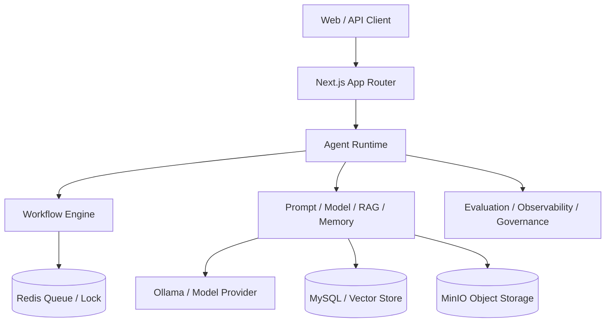
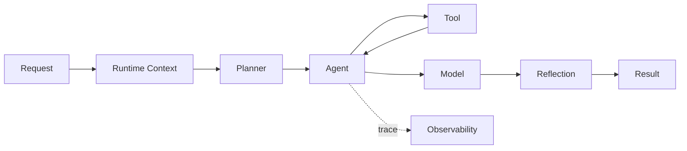
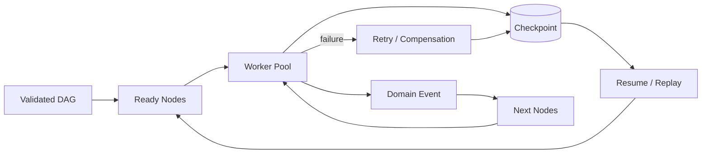
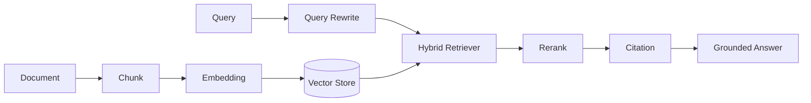
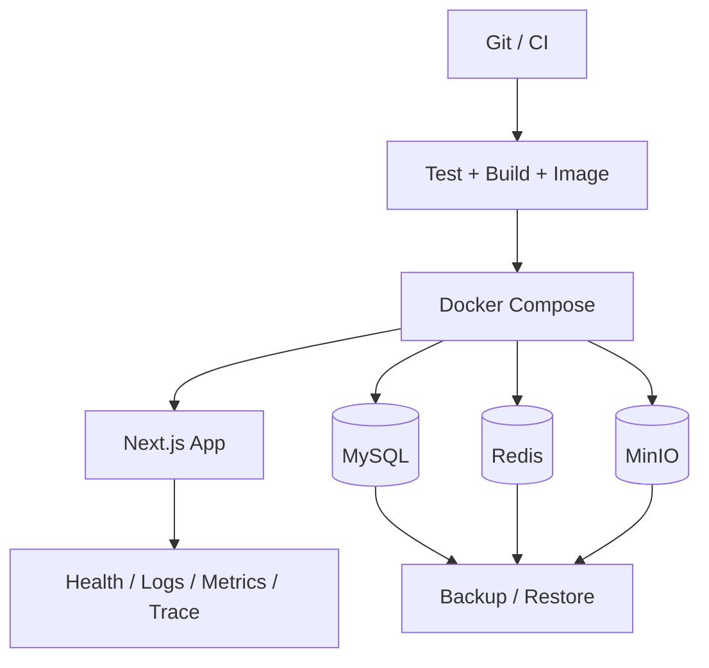

# Agent Platform v1.0 Architecture

## 模块边界

`app/` 负责 Next.js 页面和 API；`lib/` 按 Agent、Workflow、Knowledge、Memory、Prompt、Model、Evaluation、Observability、Governance、Storage 与 Queue 划分领域；`scripts/` 承载测试和运维；`migrations/` 管理数据库演进；`docs/` 解释系统与取舍；`benchmark/` 保存可复现测试协议和结果。

## 1. Overall Architecture

## 2. Agent Runtime Flow

## 3. Workflow Execution

## 4. RAG Pipeline

## 5. Production Infrastructure

## 关键运行链路

请求先经过 API Gateway 的身份、租户、权限和配额校验，再创建统一 Runtime Context。简单任务可由 Agent Runtime 直接执行；复杂任务交给 Workflow DAG，并通过 Redis Queue 调度。RAG、Memory 与 Prompt 为模型调用提供上下文，Evaluation 与 Observability 在执行后形成质量和运行反馈闭环。

## 数据与故障边界

- MySQL 保存结构化持久状态和迁移版本；Vector Store 保存检索向量；MinIO 保存对象。
- Redis 用于缓存、队列和分布式锁，不作为不可恢复的唯一事实源。
- Checkpoint 允许进程中断后恢复，Idempotency（幂等）约束避免节点重复副作用。
- Tenant ID 从 Runtime Context 贯穿存储键、查询条件、审计日志和配额统计。

## 工程取舍

本项目优先教学可读性和边界清晰度，使用单仓库模块化单体降低部署复杂度；当团队或吞吐量扩大时，可沿 Queue、RAG、Evaluation 与 Observability 边界拆分服务。完整决策见 `docs/adr/`。
